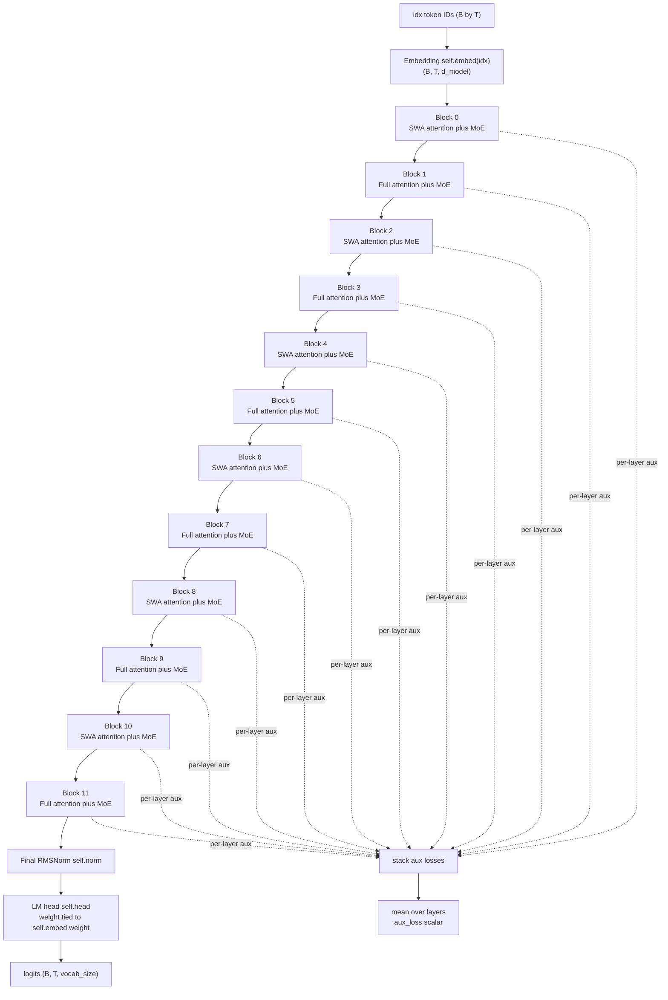

# Model Stack and Configuration Invariants

`models/transformer.py` is the composition root for GPT-OSS-Lite. `ModelConfig` is the typed boundary between YAML and construction; `GPTOSS` owns the embedding, ordered blocks, final normalization, language-model head, initialization, gradient-checkpointing policy, and parameter accounting. Attention, YaRN RoPE, and MoE routing remain in their focused sibling modules.

The production configuration is a 12-layer decoder with `d_model=768`, 8 query heads and 4 KV heads of `head_dim=96`, 8 routed experts with top-2 selection, one shared expert, `window_size=128`, and a 128K YaRN target. The GPU smoke configuration preserves the same shape relationships and alternation at a smaller scale: four layers, `d_model=128`, 4/2 heads, 4 routed experts, and top-2 routing.

## Runtime path

The model accepts token IDs `idx` with shape `(B, T)`. If callers omit `positions`, `GPTOSS.forward` creates `torch.arange(T)` on the input device. Explicit positions are the extension point for offset or cached decoding positions; they are passed unchanged through every block to YaRN RoPE.



*This flow follows `GPTOSS.forward`: embedding and block iteration, each block's returned auxiliary loss, final norm, tied head, and the `(logits, aux_loss)` return contract.*

Each block preserves `(B, T, d_model)` through two pre-norm residual sublayers:

```text
x_mid = x + GPTOSSAttention(norm1(x), positions)
x_out = x_mid + MoELayer(norm2(x_mid))
```

The attention submodule projects `x` to query shape `(B, n_heads, T, head_dim)` and key/value shapes `(B, n_kv_heads, T, head_dim)`. It applies YaRN RoPE to queries and keys, repeats K/V by `n_heads // n_kv_heads`, and invokes causal SDPA. Even layer indices use the configured sliding window; odd indices use full causal history. A configured per-head sink bias is clamped to `[-10, 15]` before it is added to the SDPA mask. The MoE flattens tokens to `(B*T, d_model)`, selects top-k routed experts, combines their weighted outputs, adds every shared expert, restores the original shape, and returns a scalar load-balancing loss.

## `ModelConfig`: one source of shape truth

YAML loading is deliberately thin: `training/pretrain.py` reads the file and constructs `ModelConfig(**cfg["model"])`, then passes that object to `GPTOSS`. Training-only values such as `aux_loss_alpha`, batch sizes, compilation, checkpointing, and optimizer settings remain under `training:` and are not model fields.

The most consequential production values are:

| Concern | Fields | Production value | Runtime owner |
|---|---|---:|---|
| Vocabulary and hidden width | `vocab_size`, `d_model` | `128000`, `768` | `GPTOSS.embed`, all blocks, `head` |
| Attention geometry | `n_heads`, `n_kv_heads`, `head_dim` | `8`, `4`, `96` | `GPTOSSAttention` projections and GQA |
| Depth and locality | `n_layers`, `window_size` | `12`, `128` | `ModuleList`, even-layer SWA |
| Routed capacity | `n_routed_experts`, `n_activated_experts`, `n_shared_experts` | `8`, `2`, `1` | `MoELayer` |
| Position scaling | `rope_theta`, `yarn_scale_factor` | `100000`, `32` | `YaRNRoPE` |
| YaRN lengths | `yarn_original_max_seq_len`, `yarn_target_seq_len` | `4096`, `131072` | frequency interpolation |
| Context contracts | `max_seq_len`, `eval_max_seq_len` | `4096`, `131072` | training windows and evaluation |
| Numerical/model policy | `dtype`, `rms_norm_eps`, `init_std` | `bf16`, `1e-5`, `0.02` | training autocast, norm, initialization |
| Output sharing | `weight_tying` | `true` | `head.weight = embed.weight` |
| MoE execution | `moe_dispatch` | `stacked` | PyTorch dispatcher; Triton is opt-in |

The smoke YAML is useful for shape-contract tests because it is not a different architecture: it retains even layer count, GQA, top-2 routing, shared experts, YaRN, tied weights, and the same even-SWA/odd-full rule.

### Fail-fast invariants

`ModelConfig.__post_init__` validates the conditions needed before module construction. These are construction failures, not best-effort repairs:

- `vocab_size`, `d_model`, `n_layers`, `window_size`, `ffn_dim`, `rope_theta`, `max_seq_len`, and `rms_norm_eps` must be positive. Both head counts must be positive.
- **GQA divisibility:** `n_heads % n_kv_heads == 0`. This guarantees an integer `n_rep` for `repeat_kv`; it also rejects `n_kv_heads > n_heads`.
- **Hidden-width identity:** `n_heads * head_dim == d_model`. This aligns the query projection output and the concatenated attention output with the residual stream width.
- **RoPE pair geometry:** `head_dim` must be positive and even. RoPE rotates dimension pairs, and both `YaRNRoPE` and the lower-level frequency helper enforce evenness.
- **Valid top-k expert counts:** `n_routed_experts > 0` and `0 < n_activated_experts <= n_routed_experts`. `n_shared_experts` may be zero but cannot be negative. Thus `topk` cannot request more routed experts than exist; shared experts are an independent always-on path.
- **Valid YaRN lengths:** `yarn_original_max_seq_len` and `yarn_target_seq_len` must be positive. `yarn_scale_factor >= 1`; when it is greater than one, `yarn_original_max_seq_len < yarn_target_seq_len` is required. A scale factor of one is the supported plain-RoPE case and does not require extrapolation.
- `eval_max_seq_len < max_seq_len` is allowed but emits a warning because evaluation then has a shorter context than training.

One warning is architectural rather than numerical: when `yarn_prune_rope_global=True` and `n_layers` is odd, construction warns that the alternating pattern expects an even layer count and that the final layer may be windowed, so it will not receive global-layer RoPE pruning. The runtime parity rule is fixed at `is_windowed = (layer_idx % 2 == 0)`; global/full layers are odd and prune `head_dim // 4` leading RoPE dimensions when pruning is enabled. Use an even `n_layers` when a balanced local/global schedule and predictable pruning are required.

### Why validation must precede runtime

The checks mirror concrete tensor operations rather than merely documenting preferred hyperparameters. For production geometry:

```text
q_proj:  d_model -> n_heads * head_dim = 768 -> 8 * 96 = 768
kv_proj: d_model -> 2 * n_kv_heads * head_dim = 768 -> 2 * 4 * 96 = 768
GQA:     repeat_kv factor = n_heads // n_kv_heads = 8 // 4 = 2
```

After transposition, `Q`, `K`, and `V` have matching head counts for SDPA because K/V are repeated from 4 to 8 heads. The output is reshaped back to `n_heads * head_dim`, then `o_proj` returns `d_model`, allowing the residual addition. A mismatch in either divisibility or the hidden-width identity would fail at these `view`, repeat, or residual boundaries; `ModelConfig` rejects it earlier with a targeted `ValueError`.

Likewise, `n_activated_experts` is passed directly to `Tensor.topk`, and `head_dim` determines both projection reshapes and the RoPE pair table. Positive YaRN lengths are needed by the logarithmic ramp calculation. Validation therefore protects the callee contracts of attention, RoPE, and MoE rather than leaving malformed settings to produce opaque runtime errors.

## Normalization and block behavior

`RMSNorm` has one learnable `weight` vector and no bias or mean-centering. It computes per-token RMS statistics in detached FP32, multiplies by the learned scale, and casts the result back to the input dtype. The default `rms_norm_eps` is `1e-5`. Each `GPTOSSBlock` has `norm1` before attention and `norm2` before MoE; `GPTOSS.norm` is a third RMSNorm after the complete stack.

The block's residuals are unscaled and ordered: attention runs first, then MoE sees the attention-updated stream. `MoERouter` computes softmax probabilities in FP32, takes `topk(n_activated_experts)`, renormalizes the selected weights, and returns raw logits for the auxiliary objective. `aux_load_balancing_loss` is computed per layer; `GPTOSS.forward` averages those scalars. The model does not apply the training coefficient itself: `training/pretrain.py` forms `ce + aux_loss_alpha * aux_loss`, with the production YAML setting `aux_loss_alpha: 0.01`.

The default `moe_dispatch: "stacked"` uses stable expert sorting, per-expert chunks, weighted expert calls, and `index_add`. `"triton_grouped"` is an explicit opt-in path that fuses W1/W3 plus SiLU in Triton while retaining PyTorch W2. This execution choice does not change the top-k or output-shape contract; it changes only dispatch implementation. The Triton path has an explicit import/runtime boundary and should not be treated as a silent fallback for unsupported hardware.

## Tied embedding/output weights

`GPTOSS` constructs `nn.Embedding(vocab_size, d_model)` and a bias-free `nn.Linear(d_model, vocab_size)`. With `weight_tying=True`, it assigns `self.head.weight = self.embed.weight`, so input token vectors and output vocabulary rows are the same registered parameter object. This saves exactly `vocab_size * d_model` parameters: `128000 * 768 = 98,304,000` in the production model. Setting `weight_tying=False` is an intentional ablation and allocates an independent output matrix.

Weight tying changes parameter accounting as well as storage. `GPTOSS.num_parameters()` tracks parameter object IDs and adds each unique object once, so it must not be replaced by a naive sum that charges the embedding and head twice. The same deduplication principle is preserved by `num_active_parameters()`. Optimizer grouping also sees the shared parameter through the model's registered parameter traversal; changes to tying must therefore be accompanied by count and optimizer-state checks.

## Parameter accounting

`num_parameters()` is the total unique learned-parameter count, including all routed experts even though only top-k routed experts execute for each token. For the production configuration it is `501,836,640` (about 502M). `num_active_parameters()` is an analytical per-token estimate, not a runtime profiler:

```text
non_moe = unique parameters whose names contain neither "experts" nor "router"
expert_params = 3 * d_model * ffn_dim       # W1, W3, W2 for one SwiGLU expert
moe_active = (n_activated_experts + n_shared_experts) * expert_params
router_params = d_model * n_routed_experts
active = non_moe + (moe_active + router_params) * n_layers
```

For production, the result is `247,032,672` (about 247M). It includes shared parameters, the selected routed-expert budget, shared experts, and one router per layer, while omitting inactive routed experts. The implementation explicitly skips names containing both `"experts"` and `"router"` in the non-MoE sweep, then adds router parameters once. Preserve this convention and unique-object handling when adding modules or changing weight tying; otherwise the headline total and active count become misleading.

## Initialization and memory-oriented execution

`GPTOSS._init_weights()` initializes every linear and embedding weight with a normal distribution of standard deviation `cfg.init_std` (production `0.02`), sets RMSNorm weights to one, and zero-initializes each enabled attention sink bias. YaRN `inv_freq` is a non-persistent buffer, not a learned parameter and not part of the parameter total.

Gradient checkpointing is enabled by `enable_gradient_checkpointing(every=3)`, which sets model attributes rather than changing the module graph. During grad-enabled forward, blocks whose index satisfies `layer_idx % grad_ckpt_every == 0` run through `torch.utils.checkpoint.checkpoint(..., use_reentrant=False)`; evaluation and no-grad inference bypass checkpointing. Training enables it from `training.grad_checkpoint` and its cadence setting. The tests verify both that backward succeeds and that the expected number of checkpoint calls actually occurs.

## Contracts to verify when changing the stack

Focused tests encode the safe-change boundary:

- `tests/test_validation.py` covers GQA divisibility, `n_heads * head_dim == d_model`, even `head_dim`, positive dimensions, top-k bounds, YaRN scale/length rules, and the production total/active anchor counts.
- `tests/test_models.py` checks `(B, T, vocab_size)` logits, scalar finite auxiliary loss, tied versus untied storage, even-SWA/odd-full alternation, pruned global RoPE, gradient flow, and checkpoint invocation.
- `tests/test_yarn.py` checks finite 128K tables, extrapolated rotations, pair geometry, identity behavior at position zero, and pruned dimensions.
- `tests/test_moe.py` checks exact top-k shapes and normalized weights, expert/shared-expert gradient flow, dispatch equivalence, finite auxiliary loss, and saturated-router stability.
- `tests/test_smoke.py` proves small configurations can execute forward and backward on CPU and that the default configuration fields remain deliberate.

A model change is safe only when the configuration equations, runtime views, and accounting remain aligned. In particular, changing head counts, head dimension, layer parity, expert counts, YaRN lengths, or tying policy should be treated as a contract change—not as a local cosmetic edit.

## Related operational boundaries

- Long-context attention and mixed KV-cache behavior: `/openwiki/concepts/long-context-attention.md`
- MoE execution and Triton dispatch: `/openwiki/concepts/moe-and-kernel-execution.md`
- Checkpoint and memory implications: `/openwiki/operations/checkpoints-memory-and-logging.md`
- Training integration: `training/pretrain.py` and `configs/pretrain_a100_502m.yaml`
