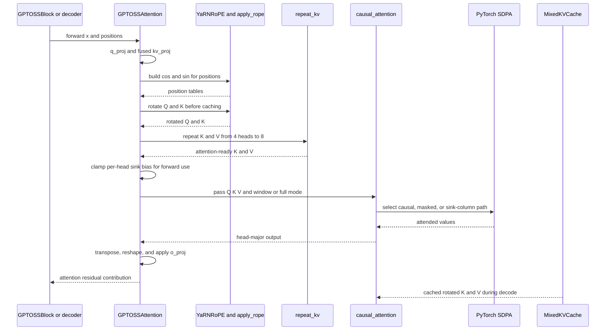
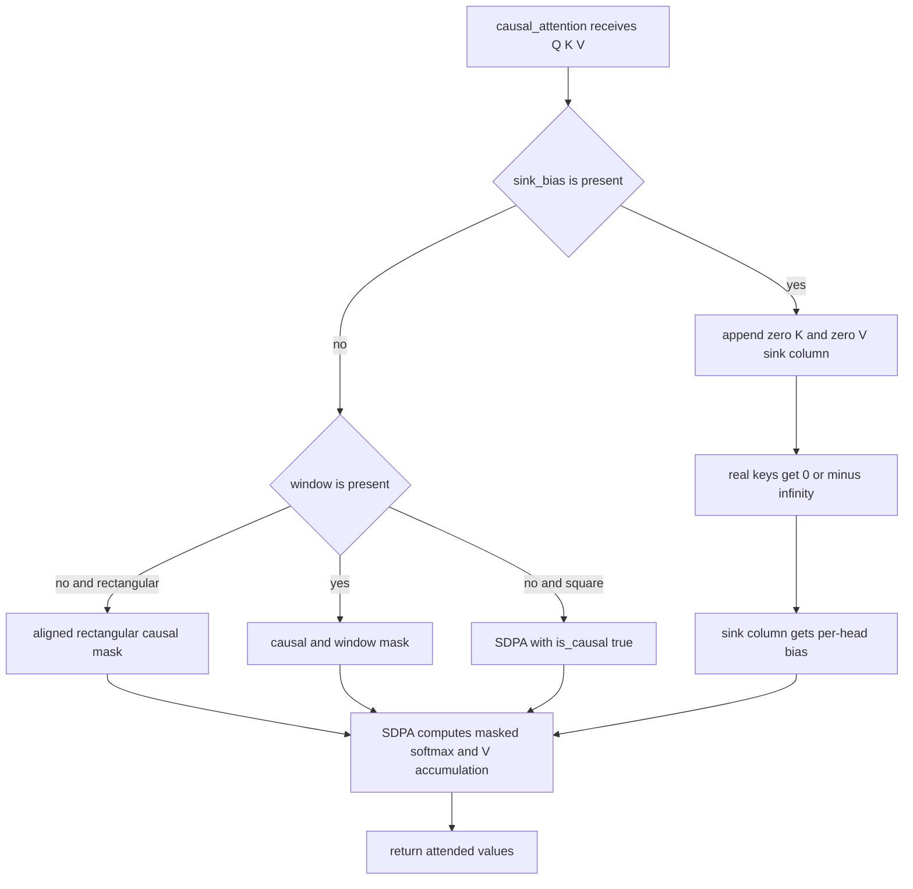

# Long-Context Attention, Sinks, and YaRN

GPT-OSS-Lite’s long-context contract is a coordinated attention design, not one switch:

- Queries use 8 heads while keys and values are projected with 4 KV heads, then repeated for GQA.
- Even-indexed layers use causal sliding-window attention with `window_size=128`; odd-indexed layers retain full causal history.
- Every enabled attention layer has one learned sink logit per query head. The sink is an extra zero-valued softmax column, not a cache entry.
- YaRN transforms the RoPE frequency grid from the 4,096-token training span toward a 131,072-token evaluation target. Full layers optionally freeze the fastest 24 of 48 frequency pairs to identity.
- Training and prompt processing use the attention module directly. Cached generation rotates new Q and K, stores rotated K, and uses a bounded ring buffer only on windowed layers.

The alternating schedule is essential to the cache reduction claim. Replacing it with 12 full-attention layers is not an equivalent implementation: it removes the bounded half of the KV cache and loses the reported mixed-cache reduction.

## End-to-end call sequence

`GPTOSSAttention.forward` owns the layer-local sequence. Its projections produce head-major tensors, RoPE is applied before attention, GQA expands K/V to the query-head count, and only then are the sink and causal or window restrictions passed to SDPA.



*The sequence shows the production attention path; the cache participant is used only by the incremental inference integration.*

## Tensor and configuration contract

The production geometry comes from `ModelConfig` and `configs/pretrain_a100_502m.yaml`:

| Stage | Shape or value | Contract |
|---|---|---|
| Input | `(B, T, 768)` | Residual-stream input to one attention block |
| `q_proj` | `(B, T, 8 * 96)` | Eight query heads |
| `kv_proj` | `(B, T, 2 * 4 * 96)` | One fused projection produces K and V for four KV heads |
| Head-major Q | `(B, 8, T, 96)` | Query layout consumed by attention |
| Head-major K and V before repeat | `(B, 4, T, 96)` | Compact GQA representation |
| Head-major K and V after repeat | `(B, 8, T, 96)` | Required matching head count for SDPA |
| RoPE tables | `(T, 48)` | One cosine and sine value per 2D pair |
| Sink parameter | `(8,)` | One learned logit per query head |
| Output | `(B, T, 768)` | `o_proj` returns to the residual width |

`ModelConfig.__post_init__` rejects non-divisible GQA head counts, odd or non-positive `head_dim`, and a mismatch between `n_heads * head_dim` and `d_model`. These checks protect the projection views, `repeat_kv`, RoPE pairing, and residual addition before runtime.

### GQA projection and broadcast

The lower KV-head count is realized at projection time, not just in the cache. `kv_proj` emits `2 * n_kv_heads * head_dim`; after RoPE, `repeat_kv` expands each KV head to `n_heads // n_kv_heads` query heads. With 8 query heads and 4 KV heads, the repeat factor is 2, so KV head 0 serves query heads 0 and 1, KV head 1 serves 2 and 3, and so on.

`repeat_kv` uses `expand` followed by `reshape`. The expansion expresses repetition without an explicit `.contiguous()` call, while the resulting layout is suitable for the downstream attention operation. When `n_rep == 1`, it returns the input unchanged. This is the head-sharing relationship that reduces KV storage and KV projection work; it does not make the attention score computation sparse by itself.

## Alternating local and global attention

`GPTOSSAttention` fixes layer mode from `layer_idx % 2`:

| Layer indices in the 12-layer production stack | Mode | Attention argument | Cache behavior |
|---|---|---|---|
| `0, 2, 4, 6, 8, 10` | Sliding-window | `window=128` | Ring buffer retains at most 128 tokens |
| `1, 3, 5, 7, 9, 11` | Full causal | `window=None` | Growing buffer retains the whole prefix |

A windowed layer can only read the causal band

\[
\mathcal{A}(i) = \{j : j \le i \text{ and } i-j < W\}.
\]

A full layer can read every prior key. The sequence is therefore local, global, local, global rather than all-local or all-global. Local layers preserve fine-grained short-range processing and bounded cache storage; global layers provide the long-range information path. Pure sliding-window attention would make context older than the window inaccessible at every depth. Pure full attention would discard the cache saving that this architecture is designed to provide.

### KV-cache reduction

For BF16 production tensors, one token in one layer costs

\[
2 \text{ tensors for K and V} \times 4 \text{ KV heads} \times 96 \text{ values} \times 2 \text{ bytes} = 1536 \text{ bytes}.
\]

The mixed cache stores `6 * min(W, T)` token slots in windowed layers and `6 * T` in global layers. The all-full baseline stores `12 * T` slots, so the analytical ratio is

\[
\frac{B_{full}}{B_{mixed}} = \frac{12T}{6\min(W,T)+6T}.
\]

The repository’s benchmark reports about `1.94x` at 4K and `2.00x` at 128K for the mixed schedule. These are KV-storage figures, not a claim that every attention kernel executes half as many FLOPs. The cache reduction depends on preserving the six windowed layers; making all layers full is not an equivalent replacement.

## Causal, window, and sink decisions

`causal_attention` is the production entrypoint and calls `torch.nn.functional.scaled_dot_product_attention`. Its mask helpers return boolean **allowed** positions. Float masks are then formed with `0.0` for allowed positions and true `-inf` for forbidden positions.



*The decision logic distinguishes the optimized square full-causal call, explicit causal or window masks, and the sink-column extension.*

### Mask semantics are not automatic sparse execution

The mask limits which keys can influence a result, but the current implementation passes ordinary tensors and masks to SDPA. It does not select a block-sparse or banded attention kernel that is guaranteed to skip all forbidden score pairs. The manual reference explicitly forms a `T` by `T` score matrix and is `O(T²)`. Masked SDPA may choose math, memory-efficient, or flash backends according to PyTorch’s device, dtype, shape, and mask heuristics; an explicit window mask is a visibility contract, not a promise of proportional sparse FLOP reduction.

The square full-causal no-sink path uses `is_causal=True`, allowing the backend’s native causal optimization. Windowed and sink paths use explicit additive masks because they need the window or per-head sink logit. Backend selection is not forced by this repository, and Q, K, and V must have compatible dtypes. Consequently, the reliable long-context memory claim here is the mixed KV-cache bound. Any separate FLOP or latency claim requires measuring the actual backend and shape.

The rectangular causal helper aligns a query block with the final `T_q` positions of a `T_k`-token key sequence. This is needed for decode and chunked inputs: a query at global position `T_k - T_q + i` may see keys through that position, but not later keys. `_window_mask` applies the same alignment and intersects it with the most-recent-window condition.

## Learned attention sinks

Each enabled `GPTOSSAttention` owns `sink_bias`, an `nn.Parameter` with one scalar per query head, initialized to zero. The sink is represented in `causal_attention` by:

1. Appending an all-zero key column. Its dot product contributes zero.
2. Appending an all-zero value column. Any probability assigned to it contributes nothing to the output.
3. Adding the per-head learned logit only in the final attention-mask column.
4. Softmaxing over real keys plus the sink, then returning the real-value accumulation.

For head `h`, the real-key weights therefore have a denominator containing `exp(sink_bias[h])`. A positive bias absorbs more mass and damps the real-value output; a sufficiently negative bias approaches no-sink behavior. The sink is always available to a query, but it occupies no `MixedKVCache` slot and does not preserve a physical token.

This is useful specifically when a window evicts old keys: the model can discard probability mass instead of forcing it to redistribute among the surviving local keys. On full layers, the sink remains enabled when configured, although eviction is not the reason for its existence.

### Forward-only clamp and gradients

Before calling `causal_attention`, `GPTOSSAttention.forward` evaluates:

```python
sink_bias_clamped = self.sink_bias.clamp(SINK_CLAMP_MIN, SINK_CLAMP_MAX)
```

The bounds are `[-10.0, 15.0]`. Clamping occurs at forward use only: the raw `nn.Parameter` is not overwritten, remains in the module and optimizer state, and stays connected to autograd. Gradients are available through the clamp where its derivative is active and saturate at a bound, so an extreme stored value can be observed without allowing an extreme mask logit into SDPA. Generation caches the clamped tensor once per attention layer in `sink_bias_cache` under `torch.no_grad()`.

The manual oracle does not clamp its `sink_bias` argument. Direct callers comparing it with production should pass the same effective bias that production uses. The production module is the normal place where the `[-10, 15]` contract is enforced.

A crucial additive-mask rule follows from the implementation: `causal.to(dtype)` is `1.0` for allowed positions and `0.0` for blocked positions, but SDPA adds float masks to scores. Therefore blocked positions must be written as `-inf`, not `0.0` or a large finite negative sentinel. The sink path explicitly uses `torch.where(causal, 0.0, float("-inf"))` for real keys; the sink column itself receives the learned bias and is not masked.

## RoPE and YaRN

### RoPE application order

`GPTOSSAttention.forward` uses contiguous default positions `torch.arange(T)` when the caller supplies none. It then:

1. Projects Q with `q_proj` and K/V with the fused `kv_proj`.
2. Transposes to `(B, H, T, D)` for Q and `(B, H_kv, T, D)` for K/V.
3. Generates `(cos, sin)` tables with `YaRNRoPE`.
4. Applies `apply_rope` to Q and K while K still has only 4 KV heads.
5. Repeats K and V to 8 heads.
6. Applies the sink clamp and invokes causal attention.

`apply_rope` splits the last dimension into 2D pairs, constructs the rotated-by-90-degree companion with `unflatten`, `flip`, and a sign change, and computes `x * cos + x_rotated * sin`. It repeats each pair’s table value across its two scalar channels and casts the tables to `x.dtype`, preserving the dtype required by SDPA. `head_dim` must be even.

### YaRN frequency transformation

The production position settings are:

| Setting | Value |
|---|---:|
| `rope_theta` | `100000` |
| `yarn_scale_factor` | `32` |
| `yarn_original_max_seq_len` | `4096` |
| `yarn_target_seq_len` | `131072` |
| `yarn_beta_fast` | `32` |
| `yarn_beta_slow` | `1` |
| `yarn_mscale` | `True` |

`compute_yarn_freqs` creates 48 base inverse frequencies for `head_dim=96`. It computes `low` and `high` frequency indices from the original length and beta values, clamps a linear ramp to `[0, 1]`, and blends each base frequency with its divided-by-32 version. Fast pairs remain near the original frequency for local resolution; slow pairs are compressed for the longer position range.

`compute_yarn_mscale` returns `1.0` for `scale_factor <= 1`; otherwise it returns `0.1 * log(scale_factor) + 1`. With scale 32, the magnitude multiplier is approximately `1.347`. `YaRNRoPE.forward` multiplies cosine and sine by this value, so `cos² + sin²` is `mscale²`, not one. This is deliberate attention-temperature compensation for the compressed frequencies. It changes Q/K magnitude but not the phase angles.

The frequency table is a non-persistent buffer. It is recomputed from configuration rather than serialized into a checkpoint, avoiding a stale table if YaRN settings change. The single-position branch avoids the full outer product and is the decode fast path. A degenerate ramp where `high <= low` emits a `UserWarning` and uses a zero ramp as an explicit identity fallback; it does not silently pretend that a valid long-context extension was configured. Invalid odd dimensions or non-positive YaRN lengths raise `ValueError`.

### Pruned RoPE on global layers

When `yarn_prune_rope_global` is enabled, `_n_pruned_dims()` returns `head_dim // 4` only for full layers. For `head_dim=96`, that is 24 leading **pair columns**, or 48 scalar channels. The inverse-frequency table is ordered fastest first, so these are the fastest pairs. `YaRNRoPE.forward` applies the normal YaRN and `mscale` computation, then clones the tables and overwrites those leading columns with exactly `cos=1.0` and `sin=0.0`.

Windowed layers keep all 48 pairs because their 128-token receptive field benefits from the fastest local position signals. Full layers score against the entire prefix and use the slower, YaRN-compressed pairs for long-range position behavior while removing the most rapidly rotating pairs. Pruning is determined only by layer parity and configuration, so the same position produces the same table in prefill and decode. That invariant is required because cached keys are already rotated.

## Prefill, decode, and cache lifecycle

### Prefill or prompt processing

The ordinary model forward receives `(B, T, d_model)` and positions `0 .. T-1` unless explicit positions are supplied. On a square input, causal masking allows each row to see its prefix. A windowed layer additionally masks keys older than 128 positions. The mask still has a dense `(T, T)` logical shape, so window visibility alone does not make the current computation sparse.

The cached generation path processes the prompt through `_attn_forward_layer`. It projects and rotates the prompt, appends rotated K and V to the per-layer cache, reads the active cache view, and computes the layer output. Windowed cache storage retains only the most recent window; global storage retains the prompt prefix. The prompt path therefore has two separate concerns: the query computation for the supplied prompt and the cache representation that later decode steps will use. Long-prompt behavior should be validated with the cache integration tests and an actual target backend rather than inferred solely from the storage bound.

### Incremental decode

For each generated token, `generate` passes a one-element position tensor containing the new token position. `YaRNRoPE` takes its scalar fast path. `_attn_forward_layer` rotates the new query and fresh key, appends the rotated key and value, obtains chronological K/V from `MixedKVCache`, repeats KV heads, and calls `causal_attention` with `T_q=1`.

Windowed cache entries are fixed-size ring buffers. On rollover, `MixedKVCache.get` unwraps the ring so keys and values are chronological and contain only the latest `window` tokens. Global entries grow dynamically, using approximately 1.5x capacity expansion, and expose the complete prefix. Since all cached keys are prior to the new query, the rectangular causal and window masks align the one query with the final cache position. No sink tensor is stored in either cache.

The no-cache generation mode replays the full prefix at each step and is a correctness reference, not the memory-efficient path. `tests/test_inference.py` checks that one generated token matches between cached and no-cache modes on a small model, while the cache tests check bounded window storage, full global storage, ring ordering, and reset behavior. A cache must be reset between prompts so state from one request cannot leak into another.

## Numerical and change-safety contracts

| Contract | Required behavior | Why it matters |
|---|---|---|
| Sink clamp | Clamp only at forward use to `[-10, 15]`; do not mutate the raw parameter | Keeps additive sink logits in a safe range while preserving parameter ownership and gradients |
| Additive masks | Allowed real keys receive `0.0`; blocked keys receive true `-inf` | A float SDPA mask is added, so `0.0` does not block a future key |
| Manual reference | Score matmul explicitly upcasts Q and K to FP32 | The `O(T²)` oracle must not make BF16 score accumulation the correctness reference |
| Dtype alignment | `apply_rope` casts tables to activation dtype and SDPA receives compatible Q, K, and V | Mixed dtype inputs can fail dispatch or change the execution path |
| YaRN ramp failure | `high <= low` warns and falls back to zero ramp | Degenerate settings must be visible rather than silently becoming a false extension |
| Router stability | MoE router softmax and auxiliary-loss softmax use FP32 separately | Router numerical stability is an MoE contract, not an attention-sink or manual-score guarantee |
| Layer schedule | Preserve even SWA and odd full layers | The schedule is the architectural basis for bounded windowed caches and the mixed KV reduction |
| Cache representation | Store rotated K and never rotate cached K again | Re-rotating cached keys would apply position encoding twice |

The manual path is intentionally a simple `O(T²)` reference and is not used as the training or inference hot path. It computes scores in FP32, applies causal and optional window fills, appends the sink logit when present, softmaxes over real keys plus sink, strips the sink probability, and multiplies by V. Production uses SDPA through `causal_attention`; equivalence is meaningful only when the same mask orientation, sink value, position alignment, dtype, and effective bias are used.

The MoE router’s FP32 softmax is a separate stability mechanism in `models/moe.py`. Do not attribute its behavior to the attention score accumulator, and do not replace the standard auxiliary routing objective when changing this attention subsystem.

## Configuration and focused verification

The main configuration knobs are `n_heads`, `n_kv_heads`, `head_dim`, `window_size`, `sink_bias`, the YaRN fields, and `yarn_prune_rope_global`. Changing head counts changes both projection shapes and cache bytes. Changing `window_size` changes the visible band and the bounded ring-buffer capacity. Changing YaRN lengths or beta values changes the frequency table and may trigger the degenerate-ramp warning. Changing layer count or parity changes which layers contribute to the mixed-cache contract.

Focused checks:

```bash
python3 -m pytest tests/test_attention.py -v
python3 -m pytest tests/test_yarn.py -v
python3 -m pytest tests/test_inference.py -v
python3 scripts/kv_cache_benchmark.py
```

`tests/test_attention.py` covers SDPA/manual agreement for windowed attention, prefill exclusion of old keys, sink-path agreement and causality, sink effects and per-head behavior, forward-time clamp safety, gradient flow, GQA repetition, and rectangular chunk causality. `tests/test_yarn.py` covers finite 128K tables, frequency spread, `mscale`, position-zero behavior, pair geometry, pruning, dtype and shape-preserving rotation, and the warning for a degenerate ramp. `tests/test_inference.py` covers ring-buffer limits and ordering, global-prefix retention, reset, and cached versus no-cache generation on a small configuration.

The analytical KV benchmark is useful for the storage contract, not for claiming sparse attention compute. For performance investigations, also inspect the actual PyTorch SDPA backend selected for the target dtype, device, mask shape, and sequence length.

## Related pages

- [/openwiki/architecture/model-stack.md](/openwiki/architecture/model-stack.md) — composition root and configuration invariants.
- [/openwiki/concepts/moe-and-kernel-execution.md](/openwiki/concepts/moe-and-kernel-execution.md) — separate MoE routing and kernel paths.
- [/openwiki/operations/checkpoints-memory-and-logging.md](/openwiki/operations/checkpoints-memory-and-logging.md) — memory and checkpoint operational context.
- [/openwiki/workflows/inference-and-evaluation.md](/openwiki/workflows/inference-and-evaluation.md) — generation and long-context evaluation workflow.
