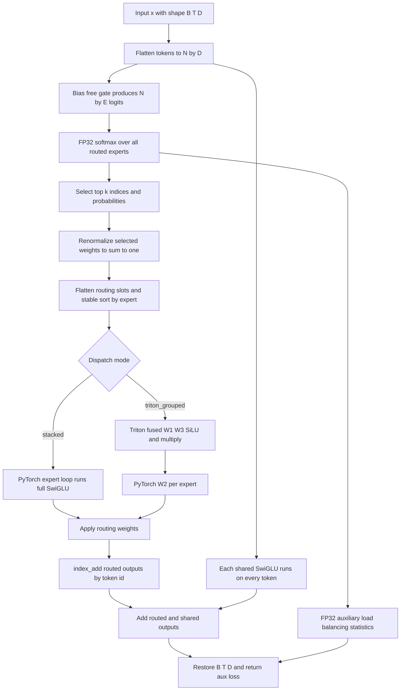

# MoE Routing and Optional Triton Execution

GPT-OSS-Lite replaces the feed-forward sublayer in every transformer block with a sparse Mixture-of-Experts layer. In the default model, each token is sent to the top 2 of 8 routed experts and to 1 shared expert. The routed contribution is a weighted sum; the shared contribution is always added independently of the router.

The execution contract has two layers:

- **Routing and dispatch semantics** are defined by the raw-PyTorch implementation in [`models/moe.py`](repo://models/moe.py). The `"stacked"` dispatcher is the reference used on CPU, without Triton, and when routing behavior is being debugged.
- **Triton is a configured optimization, not an automatic capability probe.** Only `moe_dispatch="triton_grouped"` selects the optional path. That path fuses routed W1, W3, SiLU, and the elementwise product; W2, routing weights, accumulation, shared experts, the router, and the auxiliary loss remain PyTorch.

A configured Triton run must fail visibly if Triton is unavailable, if the kernel cannot compile, or if execution fails. It must not silently change its execution path.

## Where the layer sits

`ModelConfig` owns the MoE shape and dispatch choice. Its default values are `n_routed_experts=8`, `n_activated_experts=2`, `n_shared_experts=1`, `ffn_dim=1536`, and `moe_dispatch="stacked"` ([`models/transformer.py:ModelConfig`](repo://models/transformer.py#L16-L50)). The default training YAML repeats those choices and sets `training.aux_loss_alpha: 0.01` ([`configs/pretrain_a100_502m.yaml`](repo://configs/pretrain_a100_502m.yaml#L17-L69)).

Every `GPTOSSBlock` applies attention, then pre-norm MoE, and adds the MoE result residually:

```python
x = x + self.attn(self.norm1(x), positions)
moe_out, aux_loss = self.moe(self.norm2(x))
x = x + moe_out
return x, aux_loss
```

The model collects one auxiliary loss from each block and returns their mean beside the vocabulary logits ([`GPTOSSBlock.forward`](repo://models/transformer.py#L138-L153), [`GPTOSS.forward`](repo://models/transformer.py#L186-L227)). The pretraining loop adds that scalar to cross-entropy with the configured coefficient and divides the combined loss by the gradient-accumulation count before backward ([`training/pretrain.py`](repo://training/pretrain.py#L350-L399)):

```python
loss = (ce + aux_alpha * aux_loss) / accum
```

Thus the router penalty is part of the training objective, but it is not an extra output projection or a separate forward branch.

## Token-to-expert flow

The following diagram shows the complete layer-local data flow. The shared path bypasses top-k weights, while the optional Triton boundary replaces only the grouped routed W1/W3 plus SiLU stage.



*This flow distinguishes the always-on shared expert path from routed accumulation and marks the exact optional Triton boundary.*

## The expert computation: bias-free SwiGLU

`SwiGLUExpert` owns three bias-free linear projections. For input `x`, its computation is:

```python
self.w2(F.silu(self.w1(x)) * self.w3(x))
```

`w1` is the gate projection from `d_model` to `ffn_dim`, `w3` is the value projection with the same shape, and `w2` returns from `ffn_dim` to `d_model` ([`SwiGLUExpert`](repo://models/moe.py#L11-L21)). The output has the same leading dimensions and final width as its input. Routed experts execute this complete function in the reference dispatcher; the Triton path computes only the intermediate `silu(w1(x)) * w3(x)` and applies `w2` separately.

For a normal `(B, T, D)` layer input, `MoELayer.forward` views the data as `(N, D)` with `N=B*T`. It restores `(B, T, D)` only after routed and shared results have been combined ([`MoELayer.forward`](repo://models/moe.py#L64-L105)). This flattening is an execution detail, not a change to token order: token ids are retained so each expert result can be scattered back to its original row.

## Router contract

`MoERouter` is a bias-free linear gate from `d_model` to the number of routed experts. It returns three tensors for each flattened token:

| Return | Shape | Meaning |
|---|---:|---|
| `topk_indices` | `(N, k)` | Integer ids of the selected routed experts |
| `topk_weights` | `(N, k)` | Selected probabilities after per-token renormalization, converted to the input dtype |
| `logits` | `(N, E)` | Raw gate logits retained for the auxiliary loss |

The implementation deliberately computes probabilities in FP32 before selecting experts:

```python
logits = self.gate(x)
all_probs_f32 = F.softmax(logits.float(), dim=-1)
topk_weights, topk_indices = all_probs_f32.topk(self.n_activated, dim=-1)
topk_weights = topk_weights / topk_weights.sum(dim=-1, keepdim=True).clamp(min=1e-6)
```

This has three important consequences ([`MoERouter.forward`](repo://models/moe.py#L24-L43)):

1. Softmax is over **all** `E` routed experts, not just the selected ones.
2. `topk` selects exactly `k` experts per token. With the default configuration, this is top-2 of 8.
3. The selected slice is conditioned back to unit mass. Each token's selected weights sum to approximately 1; the clamp is a defensive division guard for a degenerate zero sum, not an alternative gating rule.

The routed output for token `t` is therefore:

```text
y_routed[t] = sum(topk_weights[t, j] * expert[topk_indices[t, j]](x[t]))
```

Only selected routed experts receive task-loss gradients through their expert computations. The router itself receives gradients through the selected weights, while the auxiliary loss provides a soft balancing signal through all FP32 probabilities.

## Auxiliary load balancing

The project uses the standard Switch or GShard-style auxiliary loss. It does **not** use an aux-loss-free bias buffer or an `AuxLossFreeGate` design.

For `N` flattened tokens, `E` routed experts, and `k` selected slots per token, the implementation computes:

```text
p[t, e] = softmax(logits[t], dim=-1)       in FP32
f[e]    = count of top-k slots for e / (N * k)
P[e]    = mean over tokens of p[t, e]
L_aux   = E * sum(f[e] * P[e])
```

The hard frequency `f` describes actual dispatch, while `P` describes the gate's soft preference. Their product penalizes an expert that is both selected often and preferred strongly. `aux_load_balancing_loss` recomputes softmax in FP32, uses `torch.bincount` for hard slot counts, and casts only the final scalar back to the logits' dtype ([`aux_load_balancing_loss`](repo://models/moe.py#L46-L61)). This is important under BF16: the small probabilities of non-dominant experts must remain available to the balancing statistic and its gradient.

The default coefficient is `alpha=0.01`:

```yaml
training:
  aux_loss_alpha: 0.01
```

The value is applied in `training/pretrain.py`; it is not hidden inside `MoERouter` or `MoELayer` ([`training/pretrain.py`](repo://training/pretrain.py#L354-L378)). A caller using `MoELayer` directly receives the scalar and is responsible for deciding how to include it in an objective. A caller using `GPTOSS` receives the mean across layers.

## Stable grouped dispatch

Both dispatch implementations use the same grouping contract. Starting with `indices` and `weights` shaped `(N, k)`, the layer:

1. Flattens the `N*k` routing slots.
2. Repeats each token id `k` times so each slot still points to its source token.
3. Sorts slots by expert id with `torch.argsort(..., stable=True)`.
4. Builds `expert_counts` with `torch.bincount` and `expert_offsets` from a cumulative sum.
5. Processes each expert's contiguous slice.
6. Scales each routed result by its sorted routing weight.
7. Uses `index_add_` to accumulate duplicate token ids back into an `(N, D)` output buffer.

Stable sorting is a reproducibility invariant. It preserves the original slot order among equal expert ids, so the reference and optimized paths receive the same expert-grouped token layout. The two implementations visibly share this structure: `_dispatch_vectorized` performs the full expert call per slice, while `_dispatch_triton` replaces only the up-and-gate computation ([`MoELayer._dispatch_vectorized`](repo://models/moe.py#L168-L205), [`MoELayer._dispatch_triton`](repo://models/moe.py#L107-L166)). Empty expert slices are skipped; no routed expert is required to receive a token in every batch.

### Reference path: `moe_dispatch="stacked"`

The reference path is pure PyTorch and works on CPU, Mac, and CUDA. For each non-empty expert range, it gathers the source rows, calls that expert's complete `SwiGLUExpert`, multiplies by the routing weights, and accumulates with `index_add`. It is the correctness oracle for dispatch behavior and the recommended path for routing debugging.

The default is set in two places: `ModelConfig.moe_dispatch` defaults to `"stacked"`, and `MoELayer` uses `getattr(cfg, "moe_dispatch", "stacked")` for compatibility with config-like objects ([`ModelConfig`](repo://models/transformer.py#L16-L50), [`MoELayer.__init__`](repo://models/moe.py#L64-L84)). The layer branches to Triton only for the exact string `"triton_grouped"`; all other values currently take the reference branch. The configuration field itself does not install Triton or validate arbitrary dispatch strings, so production configuration should use the documented values explicitly.

## Opt-in Triton grouped execution

### Scope of the sanctioned fusion

`models/moe_triton.py` contains the one sanctioned custom kernel in this MoE path. `triton_moe_w1w3_silu` receives expert-sorted inputs, counts, offsets, and stacked W1 and W3 weights, and returns:

```text
silu(W1 @ x) * (W3 @ x)
```

for every routed slot. `_dispatch_triton` then loops over expert ranges in PyTorch and computes each W2 down-projection, applies the sorted routing weights, and performs the same `index_add_` accumulation as the reference path ([`triton_moe_w1w3_silu`](repo://models/moe_triton.py#L205-L222), [`MoELayer._dispatch_triton`](repo://models/moe.py#L138-L166)).

This boundary is intentional:

- **Fused in Triton:** routed W1, routed W3, SiLU, and elementwise multiplication.
- **Still PyTorch:** router gate and FP32 top-k statistics, W2, routing-weight scaling, token accumulation, shared experts, attention, norms, and the training loss.

W2 is not part of the sanctioned kernel contract. It has a different reduction and output shape, and it must remain integrated with the per-expert range, routing-weight scaling, and scatter-back sequence.

### Kernel shape and numerical behavior

The Triton launcher uses conservative fixed tiles: `BLOCK_T=16` tokens, `BLOCK_M=32` reduction elements over `d_model`, and `BLOCK_N=32` output elements over `d_ff`; it launches a three-dimensional grid over expert, token tiles, and intermediate-width tiles. Token, feature, and reduction masks protect partial tiles, and masked loads use zero values ([`_MoEW1W3SiluFunction.forward`](repo://models/moe_triton.py#L135-L186), [`_moe_w1w3_silu_kernel`](repo://models/moe_triton.py#L53-L132)).

The kernel accumulates both input projections in FP32, uses `allow_tf32=False` for the tiled dot products, applies the SiLU calculation in FP32, and casts the fused result to the output dtype before storing. The default launcher uses `num_warps=4` and `num_stages=1`; the conservative staging choice is part of the sm_75-friendly configuration documented in [`docs/concepts/kernels-and-checkpointing.md`](repo://docs/concepts/kernels-and-checkpointing.md#L91-L114).

The host wrapper rejects `d_ff` or `d_model` above 8192 with `ValueError` before launch. This is a deliberate hard boundary, not a request to fall back to the PyTorch dispatcher ([`_MoEW1W3SiluFunction.forward`](repo://models/moe_triton.py#L147-L181)).

### Autograd boundary

The Triton operation is wrapped in `_MoEW1W3SiluFunction`. Its forward saves the sorted inputs and routing metadata. Its backward does not launch a custom Triton gradient kernel: it detaches and re-enables gradients on `x_sorted`, `W1_stack`, and `W3_stack`, recomputes `_moe_w1w3_silu_reference` under `torch.enable_grad()`, and obtains gradients for those three differentiable inputs. Gradients for `expert_ids_sorted`, `counts`, and `offsets` are `None`, because they describe discrete grouping rather than differentiable model parameters ([`_MoEW1W3SiluFunction.backward`](repo://models/moe_triton.py#L188-L202)).

Consequently, “Triton execution” does not mean the whole MoE training step is Triton. The forward hot path is optimized, while backward uses the reference graph. Any exception from the reference recomputation or gradient calculation propagates; there is no alternate custom backward and no silent route back to `stacked`.

## Configuration and failure boundaries

Use the explicit model setting when the platform and kernel have been verified:

```yaml
model:
  moe_dispatch: "triton_grouped"
```

Leave the field at its default or set it to `"stacked"` for CPU and Mac development, machines without Triton, routing investigations, and unverified GPU architectures. The e2e smoke script intentionally constructs a `triton_grouped` configuration for its Triton checks and reports whether Triton is installed ([`scripts/e2e_gpu_smoke.py`](repo://scripts/e2e_gpu_smoke.py#L54-L71), [`scripts/e2e_gpu_smoke.py`](repo://scripts/e2e_gpu_smoke.py#L108-L160)).

The failure matrix is:

| Condition | Observable result |
|---|---|
| `moe_dispatch` is omitted or `"stacked"` | Pure-PyTorch grouped dispatch; Triton is not needed by the MoE forward |
| `"triton_grouped"` and Triton is not importable | `triton_moe_w1w3_silu` raises `ImportError` with install guidance and the `stacked` escape hatch |
| Triton is present but compilation or kernel execution fails | The configured run receives the Triton exception; no caller catches it to downgrade dispatch |
| `d_ff` or `d_model` exceeds 8192 | `ValueError` from the Triton autograd forward before kernel launch |
| CPU or Mac with `"triton_grouped"` | The configuration must be changed to `"stacked"`; absence of Triton is an explicit error, not an automatic fallback |
| A routed expert has zero slots | Its grouped range is skipped and the output buffer remains valid |

The import policy is module-local: `models/moe_triton.py` sets `HAS_TRITON=True` only after importing Triton and its language module, otherwise it sets `HAS_TRITON=False`. The public function checks that flag and raises a descriptive `ImportError` ([`models/moe_triton.py`](repo://models/moe_triton.py#L7-L23), [`triton_moe_w1w3_silu`](repo://models/moe_triton.py#L205-L222)). The important operational distinction is between **not selecting** Triton, which is normal, and **selecting it and failing**, which must be visible.

## Focused verification

The tests separate CPU-safe reference guarantees, policy checks, and GPU kernel parity:

```bash
python3 -m pytest tests/test_moe.py tests/test_moe_triton.py -v
```

### CPU-runnable checks

- `tests/test_moe.py` checks expert shape and gradient flow, exact top-k tensor shapes and index bounds, per-token weight normalization, auxiliary-loss finiteness and differentiability, shared-expert activity, routed dispatch against a naive calculation, and deterministic repeated dispatch ([`tests/test_moe.py`](repo://tests/test_moe.py#L16-L232)).
- `test_reference_matches_naive_per_expert_loop` and `test_reference_handles_empty_experts` establish the CPU reference and its empty-range behavior ([`tests/test_moe_triton.py`](repo://tests/test_moe_triton.py#L16-L52)).
- `test_triton_moe_raises_when_triton_missing` and `test_MoELayer_triton_dispatch_raises_when_triton_missing` protect the no-silent-fallback policy. `test_triton_moe_raises_on_hard_cap_violation` protects the 8192 shape limit ([`tests/test_moe_triton.py`](repo://tests/test_moe_triton.py#L74-L121)).
- `test_MoELayer_default_moe_dispatch_is_stacked` pins the reference dispatcher as the default ([`tests/test_moe_triton.py`](repo://tests/test_moe_triton.py#L101-L108)).

### GPU-gated checks

When both Triton and CUDA are available, the kernel is compared with `_moe_w1w3_silu_reference` in FP32 and BF16, and the full grouped path is exercised by the e2e smoke script. The GPU tests use tight FP32 tolerance and a wider BF16 tolerance appropriate to the fused FP32 accumulation and deferred output cast ([`tests/test_moe_triton.py`](repo://tests/test_moe_triton.py#L124-L168)). The smoke script also compares a `triton_grouped` `MoELayer` with a same-weight `stacked` layer at BF16 tolerance ([`scripts/e2e_gpu_smoke.py`](repo://scripts/e2e_gpu_smoke.py#L135-L160)).

A CPU test run cannot prove a Triton kernel launch or a GPU-specific compilation boundary. Conversely, a successful GPU parity test does not change the default: Triton remains opt-in, and the PyTorch grouped dispatcher remains the reference behavior.

## Change checklist

A safe change to this subsystem should preserve the following invariants:

1. The router computes softmax in FP32 and returns exactly `k` selected indices per token.
2. Selected gate weights are renormalized per token and remain aligned with their indices.
3. Auxiliary balancing remains the standard `E * sum(f * P)` objective, computed with FP32 probabilities and weighted by `0.01` in the default training configuration.
4. Grouping uses `stable=True` sorting and scatters every routed slot back to its source token with routing weights.
5. Shared experts, when configured, run for every token and are summed without router weights after routed accumulation.
6. The Triton path fuses only W1/W3 plus SiLU and multiplication; W2 remains PyTorch.
7. Triton autograd backward uses the PyTorch reference implementation and treats routing metadata as non-differentiable.
8. Missing Triton, hard-cap violations, compilation errors, and runtime errors are surfaced instead of silently selecting `stacked`.

These are the boundaries that let kernel work change execution speed without changing the MoE function, its balancing objective, or its failure semantics.
