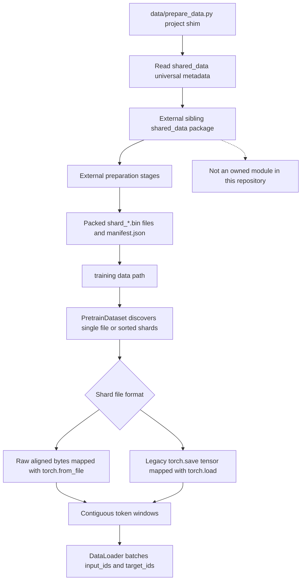

# Data Pipeline and External Tool Boundaries

GPT-OSS-Lite owns the training consumer and a small data-preparation entry point. It does **not** own the corpus builder, tokenizer implementation, downloaders, cleaners, or packer. The project shim imports `shared_data` from the sibling workspace package and delegates to it; the repository's `data/` directory contains only `prepare_data.py`, not a vendored `shared_data` implementation ([`data/prepare_data.py`](repo://data/prepare_data.py#L1-L30)).

That boundary matters operationally: a training checkout can exercise the loader and synthetic format tests locally, but the real preparation command is conditional on the sibling package being importable. The data-pipeline test module makes this explicit with `pytest.importorskip("shared_data")`; when the sibling package is absent, the whole module is skipped rather than replaced with an in-repository implementation ([`tests/test_data_pipeline.py`](repo://tests/test_data_pipeline.py#L1-L28)). Do not infer the sibling package's internal corpus algorithms from this repository. Treat its CLI and emitted files as an external contract.

## End-to-end boundary

The project-level flow is preparation outside this repository, followed by discovery and windowing inside the training process:



*Caption: preparation crosses into the sibling package, while shard discovery, format detection, and next-token windowing are implemented by GPT-OSS-Lite.*

The shim inserts the project root and its parent `LLM/` workspace root into `sys.path`, loads the sibling universal configuration to print corpus, tokenizer, and shard-size information, and then returns `shared_data.prepare_data.main()`'s result. Consequently, flags such as `--stage`, `--skip-download`, and `--skip-tokenize` belong to the delegated CLI, not to a local parser ([`data/prepare_data.py`](repo://data/prepare_data.py#L10-L30)). Run it from a CoreProjects-style layout in which `LLM/shared_data` exists, or arrange for the parent workspace to be on `PYTHONPATH`.

Typical commands are:

```bash
python3 data/prepare_data.py --stage pretrain
python3 data/prepare_data.py --stage pretrain --skip-download
python3 data/prepare_data.py --stage pretrain --skip-download --skip-clean --skip-tokenize
```

The first two commands may require the external package's configured data sources and credentials or network access. The third is useful for repacking already-produced intermediate data, but it still relies on the sibling CLI and its existing inputs. The project training configuration consumes `data/pretrain_chinchilla` ([`configs/pretrain_a100_502m.yaml`](repo://configs/pretrain_a100_502m.yaml#L71-L75)).

## Packed corpus and metadata contract

The repository documents the intended universal defaults as a LLaMA-3 tokenizer with `vocab_size: 128000`, `eos_token_id: 128009`, `pad_token_id: 128002`, and `add_eos: true`. These values are displayed by the shim from the external configuration; they are not implemented or validated by the shim itself ([`data/prepare_data.py`](repo://data/prepare_data.py#L18-L27), [`docs/training.md`](repo://docs/training.md#L1420-L1453)). The final packed stream is expected to contain token ids with EOS markers between documents, while the loader treats the stream as contiguous integers rather than parsing document records.

The packed output contract used by the tests and loader is:

- `shard_*.bin` is a headerless flat token stream for the raw format. The manifest's `dtype` determines how its bytes are interpreted; the normal project value is `uint32`, read into a signed PyTorch integer type because `torch.from_file` uses that mapping.
- A manifest may sit beside the shards. The test-facing schema includes top-level `eos_token_id`, `vocab_size`, `total_tokens`, `shard_count`, and `dtype`; shard records carry `index`, `path`, `n_tokens`, `sha256`, and `n_eos` ([`tests/test_data_pipeline.py`](repo://tests/test_data_pipeline.py#L481-L529)).
- `PretrainDataset` reads only the five loader fields `eos_token_id`, `vocab_size`, `total_tokens`, `shard_count`, and `dtype`. They are cached as metadata. A malformed or unreadable manifest is ignored and the loader falls back to `None`, `0`, and its default raw dtype behavior ([`training/pretrain.py`](repo://training/pretrain.py#L70-L89)). It does not validate the declared counts, vocabulary, EOS id, or manifest shard list against the filesystem; preflight validation must happen before a long run.
- `eos_token_id` and `vocab_size` are therefore compatibility metadata, not runtime enforcement. Check that the tokenizer, manifest, and `ModelConfig.vocab_size` agree before training. A metadata mismatch can make an otherwise readable stream semantically incompatible even though the loader can still construct tensors.

The external writer's document-boundary policy is also important: the repository's documented contract is that normal packing does not split a document across shards, while the loader is deliberately able to cross a **shard** boundary when making a training window ([`docs/training.md`](repo://docs/training.md#L1457-L1479)). Do not confuse those two boundaries. EOS is a token-level marker in the stream; it is not a separate record that `PretrainDataset` scans.

## `PretrainDataset`: single file and sharded layouts

Training constructs `PretrainDataset(data_path, model_cfg.max_seq_len)` after checking the configured path. If the path does not exist, startup raises an actionable error that names the missing path and tells the operator to run `python data/prepare_data.py` first ([`training/pretrain.py`](repo://training/pretrain.py#L55-L68), [`training/pretrain.py`](repo://training/pretrain.py#L305-L312)). An existing directory with no matching `shard_*.bin` files raises a separate `FileNotFoundError` identifying the directory ([`training/pretrain.py`](repo://training/pretrain.py#L107-L110)). This is not a permission to point `train_data_path` at an empty directory.

### Single-file mode

When `data_path` is a file, the loader selects `single` mode and calls `torch.load(data_path, weights_only=True, mmap=True)`. This is the legacy/debug tensor path: the file must be a format that `torch.load` can read, rather than a headerless raw shard. The sample count is derived as `max(1, (len(data) - 1) // max_seq_len)`, and each item slices one contiguous `max_seq_len + 1` token chunk ([`training/pretrain.py`](repo://training/pretrain.py#L102-L105), [`training/pretrain.py`](repo://training/pretrain.py#L158-L161)). A manifest next to a single file is not loaded by `_load_manifest`, which looks for `Path(data_path) / "manifest.json"`; metadata is consequently unavailable in this mode.

### Sharded mode

When `data_path` is a directory, the loader lexically sorts `shard_*.bin`, detects each file independently, obtains each token count, and builds cumulative `shard_offsets`. It retains paths, formats, sizes, and offsets rather than loading the corpus into one tensor ([`training/pretrain.py`](repo://training/pretrain.py#L107-L129)). Raw dtype selection comes from the manifest: `uint32` maps to `torch.int32`, `uint16` to `torch.int16`, and `uint8` to `torch.int8`; an unknown or absent value uses `torch.int32` ([`training/pretrain.py`](repo://training/pretrain.py#L113-L139)). For a raw shard, token count is file bytes divided by the selected element size. For a `torch_save` shard, the loader obtains `numel()` from a memory-mapped `torch.load` tensor.

Format detection is intentionally lightweight and per-file:

1. Read the first eight bytes. A `PK` prefix identifies the zip-based `torch.save` representation as `torch_save`.
2. Otherwise, a file whose size is divisible by four is classified as `raw_bytes`.
3. Any remaining file is assumed to be `torch_save`.

That heuristic makes the production raw path fast, but it is not a complete file validator: alignment alone cannot prove a file contains valid token ids. The legacy compatibility test writes a `torch.save` tensor to `shard_00000.bin` and verifies that it remains readable ([`training/pretrain.py`](repo://training/pretrain.py#L91-L100), [`tests/test_data_pipeline.py`](repo://tests/test_data_pipeline.py#L616-L627)).

`_load_shard` caches only the last loaded shard. Raw files use `torch.from_file(..., shared=True, size=...)`; saved tensors use `torch.load(..., mmap=True)`. Thus ordinary in-shard slices are zero-copy views into the mapped file, while the cache avoids reopening a neighboring shard repeatedly ([`training/pretrain.py`](repo://training/pretrain.py#L141-L153)). Randomized `DataLoader` access can still move between shards and replace that one-entry cache.

## Windows and cross-shard reads

Each sample is a next-token pair. For index `idx`, the logical stream start is `idx * max_seq_len`; the loader takes `max_seq_len + 1` tokens and returns `chunk[:-1]` as `input_ids` and `chunk[1:]` as `target_ids` ([`training/pretrain.py`](repo://training/pretrain.py#L155-L196)). The sharded fast path bisects cumulative offsets and slices one mapped shard when the complete chunk fits. If it does not, the slow path takes the required slices from successive shards, concatenates them, and then performs the same one-token shift.

This means a window **may** cross a shard boundary. The data writer's no-document-split contract means that crossing a boundary should not introduce a document fragment that was split by packing; nevertheless, the loader does not inspect EOS or reconstruct documents. The authoritative arithmetic for sample discovery is the on-disk shard sizes plus the selected dtype, and `_n_samples` is `max(1, (total - 1) // max_seq_len)` ([`training/pretrain.py`](repo://training/pretrain.py#L116-L125), [`training/pretrain.py`](repo://training/pretrain.py#L163-L191)).

The resulting tensors are consumed by the training `DataLoader`, which uses `shuffle=True`, configurable workers, CUDA-dependent `pin_memory`, persistent workers when enabled, and `drop_last=True` ([`training/pretrain.py`](repo://training/pretrain.py#L311-L322)). The loader therefore owns format compatibility and window stitching; the training loop owns device transfer and optimization, not corpus preparation.

## Optional and conditional integrations

### Triton grouped MoE execution

Triton is not a required default runtime dependency. `models/moe_triton.py` catches `ImportError` and exposes `HAS_TRITON`; the public fused function raises a clear `ImportError` when Triton is unavailable, explicitly describing `pip install triton` as Linux plus CUDA only and recommending `moe_dispatch='stacked'` on CPU or Mac ([`models/moe_triton.py`](repo://models/moe_triton.py#L15-L20), [`models/moe_triton.py`](repo://models/moe_triton.py#L205-L222)). The model selects this path only when configuration sets `moe_dispatch` to `triton_grouped`; the default is `stacked`, so there is no silent capability-based fallback ([`models/moe.py`](repo://models/moe.py#L64-L105)).

The fused boundary is narrow: Triton handles routed W1/W3 plus SiLU and multiplication, while W2, routing weights, shared experts, and the auxiliary loss remain in PyTorch ([`models/moe.py`](repo://models/moe.py#L107-L145)). CPU tests cover the PyTorch reference and explicit missing-Triton failures. Actual kernel tests are marked to skip unless both `HAS_TRITON` and `torch.cuda.is_available()` are true ([`tests/test_moe_triton.py`](repo://tests/test_moe_triton.py#L16-L36), [`tests/test_moe_triton.py`](repo://tests/test_moe_triton.py#L76-L129)).

### PyTorch CUDA

PyTorch itself is required by the model and loader, but CUDA is conditional. Training chooses `cuda:0` only when `torch.cuda.is_available()`; otherwise it uses CPU. CUDA-only performance settings such as TF32, cuDNN tuning, and the preferred cuBLASLt library are guarded by that availability check, while the generic float32 matmul precision setting is attempted on either device ([`training/pretrain.py`](repo://training/pretrain.py#L212-L226)). `torch.compile` is likewise enabled only when the YAML requests it **and** the selected device is CUDA ([`docs/training.md`](repo://docs/training.md#L191-L206)). The A100 configuration is a performance recipe, not a prerequisite for local loader or reference-path tests ([`configs/pretrain_a100_502m.yaml`](repo://configs/pretrain_a100_502m.yaml#L45-L72)).

### WandB logging

WandB is environment-triggered, not a model or data requirement. `TrainingLogger` imports it and calls `wandb.init` only when `WANDB_PROJECT` is set. `WANDB_RUN_NAME` is optional. If the package is not installed, the logger prints a skip message and continues; when initialized, it forwards rolling loss, perplexity, learning rate, throughput, and extra training metrics, and `finish()` closes the run ([`utils/logging.py`](repo://utils/logging.py#L7-L50)). The package appears in `requirements.txt`, but installing it does not activate tracking by itself ([`requirements.txt`](repo://requirements.txt#L1-L5)).

```bash
export WANDB_PROJECT=gpt-oss-lite
export WANDB_RUN_NAME=a100-pretrain-502m
python training/pretrain.py --config configs/pretrain_a100_502m.yaml
```

Without `WANDB_PROJECT`, training remains console-only. Without `wandb` installed but with the variable set, the explicit skip message distinguishes a missing optional integration from a training failure.

## Documentation and OpenWiki automation

These workflows operate on documentation artifacts and repository metadata; they are CI automation, not model-runtime dependencies.

- **GitHub Pages:** a push to `main` that changes `docs/**`, `scripts/build_docs_html.py`, assets, the README, `AGENTS.md`, or the deployment workflow, or a manual dispatch, runs on `ubuntu-latest`. It checks out the repository, sets up Python 3.11, runs `python3 scripts/build_docs_html.py`, uploads `docs_html`, and deploys the Pages artifact. The workflow grants Pages write and OIDC token permissions and cancels older runs in the `pages` concurrency group ([`.github/workflows/deploy-docs.yml`](repo://.github/workflows/deploy-docs.yml#L1-L48)). Locally, the build step is the meaningful equivalent: `python3 scripts/build_docs_html.py`; it does not prepare data or require CUDA.
- **OpenWiki:** a scheduled daily run at `0 8 * * *` or manual dispatch checks out full history, installs Node.js 22 and `openwiki@0.4.3` with optional `mermaid` and `jsdom`, then runs `openwiki code --update --print`. Its configured provider and model use CI environment variables, while the LangSmith keys come from repository secrets. A later step opens an update pull request containing `openwiki` and selected control files ([`.github/workflows/openwiki-update.yml`](repo://.github/workflows/openwiki-update.yml#L1-L63)). This process needs its configured CI credentials and networked services; it is unrelated to loading tokens or running the model locally.

For local documentation checks, `scripts/check_docs.py` validates the repository's `docs/` markdown links, paths, stale patterns, and control characters; it can also invoke the symbol checker. It is a documentation quality gate, not a corpus or runtime health check ([`scripts/check_docs.py`](repo://scripts/check_docs.py#L1-L20), [`scripts/check_docs.py`](repo://scripts/check_docs.py#L162-L176)).

## Focused verification matrix

| Area | Local exercise | Conditional requirement |
|---|---|---|
| External preparation | `python3 data/prepare_data.py --stage pretrain` | Sibling `shared_data` package and its data inputs are available |
| Loader and formats | `python3 -m pytest tests/test_data_pipeline.py -v` | Entire module skips when `shared_data` cannot be imported |
| Missing data | Construct `PretrainDataset` with a missing path or empty shard directory | No external package needed once the module can be imported |
| Raw and legacy shards | Tests for raw `uint32` shards, manifest metadata, cross-window shifting, and `torch.save` compatibility | A valid local fixture or sibling test dependencies |
| MoE reference | `python3 -m pytest tests/test_moe_triton.py -v` | CPU reference runs without Triton; GPU kernel cases skip otherwise |
| WandB | Set `WANDB_PROJECT` and run training | Package and network/account setup only when tracking is enabled |
| Docs portal | `python3 scripts/build_docs_html.py` and `python3 scripts/check_docs.py` | No model, corpus, CUDA, or WandB runtime |
| OpenWiki refresh | Managed by `.github/workflows/openwiki-update.yml` | GitHub Actions, Node 22, provider credentials, secrets, and network |

The smallest useful pretraining smoke check after data is available is:

```bash
python3 -c "from training.pretrain import PretrainDataset; d=PretrainDataset('data/pretrain_chinchilla', 4096); print(len(d), d[0][0].shape)"
```

If the path is missing, fix preparation or the configured path rather than suppressing the exception. For the broader relationship between data availability, checkpoint state, memory checks, and logging, see the related operations and pretraining pages.
