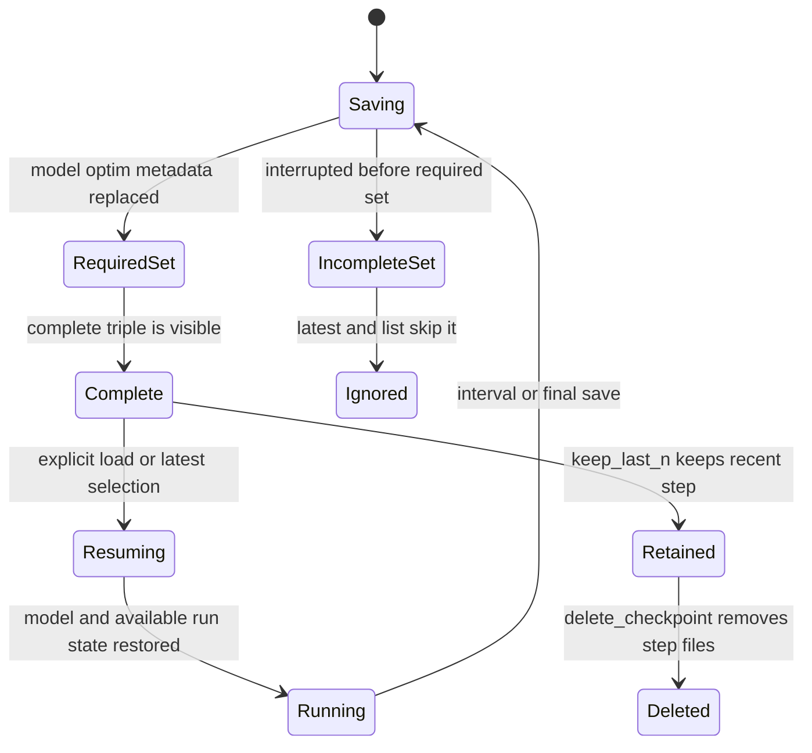

# Persistence, Resource Guards, and Run Operations

This page is the operational boundary between `training/pretrain.py` and the filesystem, CUDA runtime, and run observers. It is deliberately about behavior rather than a source-file inventory: checkpoint files are the recovery contract, the memory helper is a conservative planning guard, and the scripts provide focused measurements rather than interchangeable performance numbers.

## Checkpoint contract

`CheckpointManager` in `utils/checkpoint.py` owns the model, optimizer, scheduler, and metadata files for a training step. A normal save for step `N` creates:

| File | Storage | Required for a complete step | Meaning |
|---|---|---:|---|
| `model_step_N.safetensors` | safetensors | Yes | `model.state_dict()` weights |
| `optim_step_N.pt` | `torch.save` | Yes | AdamW optimizer state |
| `sched_step_N.pt` | `torch.save` | No | Scheduler state, only when a scheduler is passed to `save` |
| `meta_step_N.json` | JSON | Yes | At minimum `{"step": N}`, plus JSON-native `extra_meta` |
| `rng_step_N.pt` | `torch.save` from `pretrain.py` | No | Python, NumPy, PyTorch, and optional CUDA RNG snapshots |

The complete-checkpoint invariant is specifically the model, optimizer, and metadata triple. `sched_step_N.pt` and `rng_step_N.pt` are valuable resume artifacts but are not required by `_checkpoint_complete`. Consequently, `latest_step()` and `list_checkpoints()` ignore a step missing any member of the triple, while a step with no scheduler or RNG file can still be considered complete.

The save is not one filesystem transaction. Each individual file is written through a sibling temporary file in `save_dir`, then committed with `os.replace`. Temporary suffixes are `.safetensors.tmp`, `.pt.tmp`, and `.json.tmp`; an exception attempts to remove the temporary file. Same-directory replacement avoids a cross-filesystem rename and means a reader does not observe a partially written individual artifact. A process crash between the separate model, optimizer, scheduler, and metadata writes can nevertheless leave an incomplete *set*. The completeness filter is what prevents that set from being selected as the latest checkpoint.

Caption: A checkpoint step becomes selectable only after its model, optimizer, and metadata files are all present; optional artifacts enrich resume but do not define completeness.

### Weight storage and tied parameters

Weights use safetensors, while optimizer, scheduler, and metadata retain their native formats. GPT-OSS-Lite can tie `head.weight` to `embed.weight`, so two state-dict names can refer to one storage pointer. `CheckpointManager._atomic_save_safetensors` de-duplicates repeated `data_ptr()` values and keeps the first occurrence. The current implementation drops the later duplicate key rather than writing a second physical tensor; `tests/test_utils.py::test_checkpoint_dedup_drops_duplicates` asserts that a tied save contains `embed.weight` but not `head.weight`.

This avoids safetensors rejecting aliased storage and avoids duplicating the large embedding matrix. It also makes tied-weight changes a strict-loading hotspot: `load()` asks the model to load with `strict=False`, then applies its own missing and unexpected-key validation. With `strict=True` (the default), a layout whose keys do not match the deduplicated file can raise `RuntimeError`; use `strict=False` only for an intentional partial or architecture-experiment load, not to conceal an accidental mismatch.

### Selection, retention, and deletion

- `latest_step()` returns the highest complete step or `None`.
- `list_checkpoints()` returns complete steps in ascending order.
- `delete_checkpoint(N)` removes the model, optimizer, scheduler, and metadata paths for `N`.
- `keep_last_n(n)` retains the newest `n` complete steps and calls deletion for older ones.

Retention is not automatic in `pretrain.py`; call `ckpt.keep_last_n(...)` after a scheduled save if disk growth matters. `delete_checkpoint` does not remove `rng_step_N.pt`, because RNG files are outside `CheckpointManager`'s four managed filename patterns. Operators who retain or delete checkpoints should account for those sidecar files separately. Also avoid treating a directory containing arbitrary model files as a valid run: completeness is determined by the required triple, not by a directory name or by the presence of a scheduler/RNG sidecar.

## Resume and recovery behavior

The pretraining entrypoint creates one manager for `training.save_dir`. With `--resume-from N`, it calls `ckpt.load` and restores, when present:

1. model weights from `model_step_N.safetensors`;
2. optimizer state from `optim_step_N.pt`;
3. scheduler state from `sched_step_N.pt`;
4. metadata, using `{"step": N}` if `meta_step_N.json` is absent;
5. RNG state from `rng_step_N.pt`, if that sidecar exists.

The model weight file is mandatory for an explicit load and a missing file raises `FileNotFoundError` with the manager's discovered model steps. The optimizer and scheduler arguments are optional. If an optimizer is supplied but its file is missing, the loader logs a warning and leaves the current optimizer state in place, effectively starting optimizer state from scratch. A missing scheduler file has a distinct warning and leaves the current scheduler state in place. Missing metadata falls back quietly to the requested step. RNG restoration is also optional: if `rng_step_N.pt` is absent, `pretrain.py` simply does not restore Python, NumPy, PyTorch, or CUDA generators and continues with the process's current RNG state; it does not emit the optimizer/scheduler warning.

The RNG snapshot is written directly by `pretrain.py` *after* the final `ckpt.save`, and is not managed by `CheckpointManager` or included in the complete triple. It contains `random.getstate()`, `np.random.get_state()`, `torch.get_rng_state()`, and `torch.cuda.get_rng_state_all()` when CUDA is available. Thus a final model checkpoint can be complete even if the RNG sidecar was never written. Resume restores the step recorded in metadata and starts the loop from there, but it does not restore a DataLoader position, sampler order, gradient-accumulation micro-step, or other input-pipeline state. Exact replay should not be assumed merely because the RNG sidecar exists.

The NaN guard is a separate recovery path. On a non-finite loss it clears gradients and retries; after `nan_guard_max_consecutive` failures it chooses `latest_step()` and reloads model, optimizer, and scheduler. If no complete checkpoint exists, it raises instead of pretending to recover. This rollback path does not restore an RNG sidecar, so repeated data or stochastic operations after rollback are not necessarily bit-for-bit continuation. The config defaults are `nan_guard: true` and five consecutive failures.

The training loop saves at `save_interval` only after a completed optimizer/scheduler step and saves a final checkpoint at the end, with `extra_meta` such as `aux_loss` or `{\"final\": true, \"seed\": seed}`. The checkpoint round-trip, atomic temporary-file cleanup, and complete-step discovery are covered by `tests/test_training.py`; retention, deletion, and tied-weight behavior are covered by `tests/test_utils.py`.

## Memory estimates and the startup guard

`utils.memory.estimate_model_memory_gb` is a planning estimate, not `torch.cuda.max_memory_allocated()` and not an allocator measurement. It returns `0.0` for a model without `model.cfg`. Otherwise its model is:

\[
\mathrm{estimated\ GB} = \frac{P + O + KV + A}{1024^3} + \mathrm{overhead\ GB}
\]

where:

- **Parameters `P`** use each parameter's native `element_size()`.
- **Optimizer `O`** assumes AdamW with FP32 first moment, second moment, and master copy: 12 bytes per parameter.
- **KV** counts K and V, not Q, with a hard-coded BF16 assumption of 2 bytes per element. For each token and layer, `2 * n_kv_heads * head_dim * 2` bytes are charged.
- **Activations `A`** are an approximation based on layers, sequence length, batch size, model width, and BF16 bytes. With gradient checkpointing, `store_factor = ckpt_factor + (1 - ckpt_factor) * 0.5`, where `ckpt_factor = 1 / grad_ckpt_every`; without it, the factor is 1. MoE adds a conservative `3 active paths * 3 width multiplier * ffn_dim` term per layer. Routing skew and temporary kernel workspaces can differ from this approximation.
- **Overhead** defaults to 2.0 GB without CUDA, or `min(13.7, max(2.0, total_device_memory * 0.17))` with CUDA. Tests can pass `overhead_gb=0.0` to isolate formula terms.

The KV term has two operational meanings. With the default `steady_state=False`, each windowed layer is charged `max(window_size, seq_len)` tokens. This is the prefill or training-oriented estimate: `GPTOSS.forward` processes the full sequence and does not use incremental decode buffers. With `steady_state=True`, windowed layers are charged only `window_size` tokens while global layers retain the full `seq_len`; this models a warmed `MixedKVCache` during decoding. For the production 12-layer configuration, six windowed layers and six global layers use four KV heads, head dimension 96, BF16, and a window of 128. At long context, the steady-state KV shape is approximately `(6 * 128 + 6 * T) * B * 1536` bytes, whereas prefill charges all 12 layers at the requested sequence length when `T` exceeds the window.

This distinction must remain visible when comparing numbers. The standalone `scripts/kv_cache_benchmark.py` is an analytical BF16, batch-1 comparison of all-full GQA against the mixed windowed/global formula and reports about a 2x reduction at 131072 tokens. It does not load a model, measure an allocator, or include parameters, optimizer, activations, or overhead. Conversely, `estimate_model_memory_gb` includes those planning terms and can be used with `steady_state=True` for an inference budget.

`assert_fits_in_available_gpu(estimate_gb, safety_margin_gb=2.0)` is a second, simple guard. It is a no-op without CUDA, reads device 0's total memory, and raises if the estimate exceeds available memory minus the safety margin. `pretrain.py` catches that `RuntimeError` and prints a warning, so the current policy is advisory rather than a hard startup refusal. Tightening this policy requires changing the caller's exception handling, not the estimator formula. The CPU fallback of `scripts/microbench_a100.py` uses the estimate; its CUDA path instead runs a no-grad forward and reports actual `torch.cuda.max_memory_allocated()`, so those two outputs must not be presented as the same measurement.

The focused memory tests in `tests/test_utils.py` check the windowed/global delta, positive bounded output, checkpointing savings, the `grad_ckpt_every` relationship, and CPU no-op behavior of the guard. When modifying the formula, preserve explicit BF16, AdamW-state, activation-heuristic, prefill-versus-steady-state, overhead, and safety-margin assumptions and update these tests together.

## Local logging and optional WandB

`TrainingLogger` is mandatory local run output: it aggregates loss values, prints a rolling human-readable line, and does not require an external service. `pretrain.py` constructs it with `log_interval`, the model sequence length, and the effective batch size `micro_batch_size * gradient_accumulation_steps`. On a logging boundary it reports mean loss over its window, perplexity `exp(mean loss)`, scheduler LR, and tokens/sec computed as:

\[
\mathrm{tokens/sec} = \frac{\mathrm{log\_interval} \times \mathrm{seq\_len} \times \mathrm{batch\_size}}{\mathrm{elapsed\ time}}.
\]

Extra metrics are printed as additional fields. The training loop passes cross-entropy as `loss` and passes the router auxiliary loss separately as `metrics={"aux": ...}`; the displayed loss is therefore not the CE-plus-aux optimization objective. The same values are sent under `train/loss`, `train/ppl`, `train/lr`, `train/tokens_per_sec`, and `train/<metric>` when external forwarding is enabled. `finish()` closes that optional run.

WandB is opt-in only. Setting `WANDB_PROJECT` causes `TrainingLogger` to import `wandb` and call `wandb.init`; `WANDB_RUN_NAME` is optional. If the package is unavailable, the logger prints `[logging] wandb not installed -- skipping WandB integration` and local stdout logging continues. No `WANDB_PROJECT` means no `wandb.init`, so local logging is the required operational baseline and WandB is not a training prerequisite. Keep this boundary when adding metrics or changing run startup.

A malformed zero `log_interval` is a configuration hazard: the training loop protects its save/log trigger with `max(1, log_interval)`, but `TrainingLogger.log` itself uses `step % self.log_interval`. Treat the interval as a positive integer rather than relying on the caller's safe divisor.

## CUDA performance knobs and benchmark runbook

At training startup, `_set_hardware_perf_knobs()` enables CUDA TF32 for matmul and cuDNN, enables `torch.backends.cudnn.benchmark`, sets `benchmark_limit = 0` for exhaustive algorithm search, and prefers `cublaslt`. It also requests `torch.set_float32_matmul_precision("high")` where supported. These choices assume long-running fixed-shape batches on the target Ampere workload; benchmark warmup and synchronization are important before comparing results. `torch.compile` is enabled only on CUDA when configured, uses the configured mode (production default `max-autotune`), and falls back to eager execution with a message if compilation fails.

Use the scripts for the question they answer, not as a single generic scorecard:

| Question | Command | What it actually measures |
|---|---|---|
| Is the architectural KV reduction present? | `python3 scripts/kv_cache_benchmark.py` | CPU-only analytical all-full versus SWA/full BF16 cache size; exit success requires at least 1.8x at 128K |
| Does production-style inference fit a VRAM threshold? | `python3 scripts/microbench_a100.py --config configs/pretrain_a100_502m.yaml --batch-size 8 --seq-len 4096 --threshold-gb 25.0` | CUDA no-grad forward peak allocation, or the analytical estimator on CPU |
| What is training throughput and approximate MFU? | `python3 scripts/step_time_a100.py --config configs/pretrain_a100_502m.yaml --batch-size 8 --seq-len 4096 --steps 20 --warmup 5 --compile` | Warmed training steps using plain `cross_entropy`; CUDA reports tokens/sec and an approximate MFU, CPU reports throughput only |
| Which model component is slow? | `python3 scripts/profile_components.py` | Warmed component timings on `micro_cfg()`: full model, windowed/global attention, manual/SDPA/SWA attention, MoE, RoPE, and `repeat_kv` |
| Is MoE dispatch the bottleneck? | `python3 scripts/profile_moe.py` | Focused `MoELayer` and `_dispatch_vectorized` timings with YaRN global pruning disabled; it uses a small CPU config as written |
| Is cached decode slow? | `python3 scripts/profile_inference.py` | Greedy `generate()` timing for prompt lengths 8, 32, and 128 with 64 new tokens after a short warmup |

`step_time_a100.py` deliberately uses plain `cross_entropy`, not production `chunked_cross_entropy`, so it is a raw step-time benchmark rather than an end-to-end training-parity result. `profile_components.py` uses `_bootstrap.time_fn`, which warms up and synchronizes CUDA when available; absolute values are hardware-specific and are most useful before versus after a targeted change. `profile_inference.py` exercises `MixedKVCache` through `generate`, while the analytical KV script exercises no runtime cache at all.

For a practical pre-push sequence, run `python3 scripts/check_docs.py`, `python3 scripts/kv_cache_benchmark.py`, and `pytest tests/ -q`; add `python3 scripts/e2e_gpu_smoke.py` when a CUDA GPU is available. The GPU smoke path is especially valuable after changing attention, MoE, generation, or checkpoint code because it combines forward/backward, optimizer steps, checkpoint save/load, mixed-cache generation, and extended-context behavior in one small run.

## Change checklist and failure triage

Before changing runtime behavior, inspect the boundary that owns the behavior and verify the corresponding invariant:

1. **Persistence:** Are model, optimizer, and metadata still written as sibling-temp replacements? Does a crash leave only an ignored incomplete set? If changing tied weights, test both safetensors contents and strict load behavior.
2. **Resume:** Is the optimizer/scheduler warning behavior intentional? If reproducibility matters, is the RNG sidecar written and retained, and is the lack of DataLoader-state restoration acceptable? Remember NaN rollback restores no RNG sidecar.
3. **Retention:** Does cleanup include both manager files and externally written `rng_step_N.pt` sidecars? Is the newest complete triple protected?
4. **Memory:** Is the change affecting parameters, AdamW 12-byte state, BF16 KV, approximate activations, prefill or steady-state cache behavior, overhead, or the 2 GB guard margin? Compare allocator measurements only with allocator measurements.
5. **Logging:** Is local stdout still available without `wandb`? Is `WANDB_PROJECT` the only enable switch? Are CE and auxiliary metrics still distinguishable, and is the logging interval positive?
6. **Performance:** Is the selected benchmark measuring the changed path, with warmup and CUDA synchronization? Do not infer production training performance from the raw-CE step benchmark or infer allocator usage from the analytical KV benchmark.

These checks connect the utility tests, `training/pretrain.py` recovery paths, and the focused benchmark scripts to the operational decisions an agent must make before editing runtime code.
