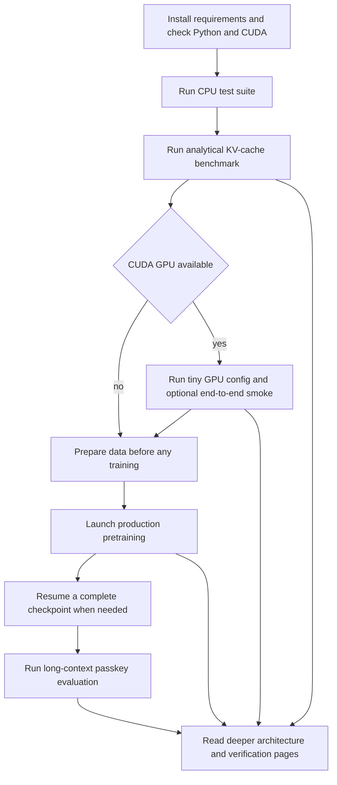

# GPT-OSS-Lite Quickstart

This is the execution order for a safe first run. Work from the repository root, treat source code and focused tests as authoritative, and distinguish three different outcomes: CPU correctness, analytical cache accounting, and trained-model quality. The full 8B-token pretraining run has **not** been completed, and the trained 128K passkey result is therefore still a target rather than a result.

## Route at a glance



*This flow separates CPU and analytical checks from CUDA integration, data preparation, training state, and trained-model evaluation.*

## 1. Install and establish the environment

The supported baseline is Python 3.10+ and PyTorch 2.1+. The requirements file installs PyTorch, `safetensors`, YAML support, progress reporting, and optional-capable WandB logging:

```bash
git clone https://github.com/atandra2000/GPT-OSS-Lite.git
cd GPT-OSS-Lite
pip install -r requirements.txt
python3 -c "import torch; print(torch.__version__, torch.cuda.is_available())"
```

Scripts add the project root to `sys.path`; there is no `setup.py` installation step. CPU-only machines can verify the architecture and run the analytical KV benchmark. Full production training, the GPU smoke script, and CUDA compilation require a CUDA environment. Triton is only needed for the explicitly selected `moe_dispatch: "triton_grouped"` path; the normal configuration uses `"stacked"`.

For the model composition and configuration invariants, continue to [Model Stack and Configuration Invariants](/openwiki/architecture/model-stack.md). For external corpus and optional-tool boundaries, use [Data Pipeline and External Tool Boundaries](/openwiki/integrations/data-and-tooling.md).

## 2. Run the CPU correctness gate

Start with the full CPU-friendly suite:

```bash
python3 -m pytest tests/ -q
```

The suite covers model forward and backward behavior, configuration validation, alternating attention and sink causality, YaRN, MoE routing and auxiliary loss, cache lifecycle and generation, dataset windows, checkpoint round trips, memory helpers, and numerical guard behavior. Some integration or GPU/Triton tests may be skipped when their dependencies are unavailable; inspect the pytest summary rather than treating a skip as a pass for that boundary.

Use a narrow test while iterating, then rerun the full suite when a shared boundary changes:

```bash
python3 -m pytest tests/test_attention.py -v
python3 -m pytest tests/test_inference.py -q
python3 -m pytest tests/test_moe.py tests/test_moe_triton.py -q
python3 -m pytest tests/test_training.py tests/test_utils.py -q
python3 -m pytest tests/test_validation.py tests/test_models.py tests/test_smoke.py -q
```

After changing documentation or a cited symbol, also run the repository-required documentation gates:

```bash
python3 tests/test_doc_refs.py --strict-coverage
python3 scripts/check_docs.py
```

The [Verification Matrix and Change-Safety Guide](/openwiki/testing/verification.md) maps changes to the narrowest valid checks. In particular, never replace an attention or cache regression test with a benchmark, and never disable the NaN guard to make a run appear healthy.

## 3. Validate KV-cache accounting without a model or GPU

Run the deterministic analytical benchmark:

```bash
python3 scripts/kv_cache_benchmark.py
```

It computes BF16 K/V storage for the production constants: 12 layers, six windowed layers capped at `WINDOW = 128`, six global layers, four KV heads, and `head_dim = 96`. The mixed cache is approximately

```text
6 * min(128, T) + 6 * T
```

times the per-token K/V bytes, versus `12 * T` for an all-full baseline. At 131,072 tokens the script must meet its configured `1.8x` threshold and should report roughly a `2.0x` reduction. This proves the architectural size calculation only; it does not load weights, measure allocator usage, or prove long-context retrieval.

Use [Long-Context Attention, Sinks, and YaRN](/openwiki/concepts/long-context-attention.md) for the attention contract and [Incremental Generation and Long-Context Evaluation](/openwiki/workflows/inference-and-evaluation.md) for runtime cache behavior. The cache benchmark is also the right check after changing layer alternation, `window_size`, GQA dimensions, or production architecture constants.

## 4. Exercise the tiny GPU path

### 4.1 Tiny training smoke

On a GPU with about 4 GB VRAM, run the structurally representative five-step configuration:

```bash
python3 training/pretrain.py \
    --config configs/pretrain_gpu_smoke.yaml \
    --seed 42
```

This config keeps the important path—alternating windowed and full attention, sink bias, YaRN, MoE routing, gradient checkpointing, checkpoint save, and the NaN guard—while reducing the model to `d_model=128`, four layers, `max_seq_len=64`, `micro_batch_size=2`, and five steps. It explicitly sets `compile: false` and `moe_dispatch: "stacked"` for a short smoke run. The seed initializes Python, NumPy, and PyTorch generators and sets the CUDA reproducibility workspace when applicable.

### 4.2 Broad CUDA integration smoke

When CUDA and Triton are available, run:

```bash
python3 scripts/e2e_gpu_smoke.py
```

This script is stricter than the tiny training command: it exits when CUDA is absent and its eight-step path also requires Triton for the explicit `triton_grouped` equivalence checks. It exercises tiny-model BF16 forward and backward with gradients on every parameter, `stacked` versus `triton_grouped` MoE behavior, a five-step optimizer loop, checkpoint round-trip, cached greedy generation, and a finite YaRN forward beyond the training sequence length. A CPU pytest pass is not a substitute for this CUDA/Triton boundary.

The [MoE Routing and Optional Triton Execution](/openwiki/concepts/moe-and-kernel-execution.md) page explains why an explicitly requested Triton failure must surface instead of silently falling back. The [Persistence, Resource Guards, and Run Operations](/openwiki/operations/checkpoints-memory-and-logging.md) page explains the checkpoint and memory implications.

## 5. Prepare data before production training

No pre-tokenized training shards are committed with this repository. Prepare them before invoking the production config:

```bash
python3 data/prepare_data.py
```

`data/prepare_data.py` is a shim around the sibling `shared_data` pipeline. The intended production layout is `data/pretrain_chinchilla/`, containing packed `shard_*.bin` files and a `manifest.json` with metadata such as vocabulary, EOS, total-token, shard-count, and dtype information. The production YAML expects that directory; the GPU smoke YAML expects `data/pretrain_smoke` instead, so do not point either run at an empty directory.

The training dataset reads contiguous next-token windows from a single file or sharded directory. It uses memory mapping where supported, can read raw-byte and legacy Torch shard formats, and raises an explicit `FileNotFoundError` with the preparation hint when data is absent. The shared-data tests are conditional on the sibling package being importable; a skip means that external integration was not exercised.

For the complete boundary—tokenizer metadata, manifest and shard formats, optional WandB, Triton, CUDA, and docs automation—see [Data Pipeline and External Tool Boundaries](/openwiki/integrations/data-and-tooling.md).

## 6. Launch the production pretraining workflow

The canonical single-A100 recipe is:

```bash
python3 training/pretrain.py \
    --config configs/pretrain_a100_502m.yaml \
    --seed 42
```

The YAML describes the approximately 502M-total and 247M-active model: 12 layers, 8 query heads and 4 KV heads, top-2 of 8 routed experts plus one shared expert, BF16, `max_seq_len: 4096`, and a 131,072-token evaluation target. Its training settings are `micro_batch_size: 8`, `gradient_accumulation_steps: 4`, `total_steps: 61000`, warmup followed by cosine decay, gradient clipping, checkpointing every 2000 steps, and `nan_guard: true`.

At startup `training/pretrain.py` loads YAML, constructs `ModelConfig` and `GPTOSS`, applies CUDA performance settings, optionally compiles with the configured mode, performs an advisory memory estimate, creates AdamW and the warmup/cosine scheduler, and constructs a shuffled packed-token `DataLoader`. Each micro-batch runs BF16 autocast on CUDA, chunked cross-entropy plus `aux_loss_alpha * aux_loss`, a finite-loss check, backward, and—at an accumulation boundary—gradient clipping, optimizer step, scheduler step, and zeroing. Logging and interval checkpoints happen after completed optimizer steps; a final checkpoint is always written.

If you need a bounded integration run while debugging the production shape, use the existing override rather than editing the YAML:

```bash
python3 training/pretrain.py \
    --config configs/pretrain_a100_502m.yaml \
    --seed 42 \
    --max-steps 10
```

This still needs compatible training data and the model can be expensive. For the full lifecycle, including compilation, accumulation, logging, checkpointing, memory estimates, and recovery, read [Pretraining Runtime Workflow](/openwiki/workflows/pretraining.md).

### Non-finite loss is a recovery signal

The loop checks `torch.isfinite(loss)` before backward. With the default guard enabled, a non-finite loss clears gradients and retries; after five consecutive failures it reloads the latest complete checkpoint, or raises if no rollback checkpoint exists. Investigate learning rate, data, and routing when this happens. Preserve `nan_guard: true`; do not recommend or use disabling it as a troubleshooting step.

## 7. Resume safely from a checkpoint

To continue from step 40000 in the production save directory:

```bash
python3 training/pretrain.py \
    --config configs/pretrain_a100_502m.yaml \
    --seed 42 \
    --resume-from 40000
```

A normal step `N` consists of:

- `model_step_N.safetensors` — model weights;
- `optim_step_N.pt` — optimizer state;
- `sched_step_N.pt` — scheduler state when one was saved;
- `meta_step_N.json` — step and JSON metadata; and
- `rng_step_N.pt` — the Python, NumPy, PyTorch, and CUDA RNG snapshot written by `pretrain.py`.

For checkpoint selection, the required complete triple is model, optimizer, and metadata. The scheduler and RNG files improve continuation but are optional to completeness. Individual files are written through sibling temporary files and atomically replaced; an interrupted multi-file save can still leave an incomplete set, which `latest_step()` ignores.

Resume restores model weights, available optimizer and scheduler state, metadata, and the RNG sidecar when present. It does **not** restore DataLoader position, sampler order, or an in-progress accumulation micro-step, so an RNG sidecar alone is not a guarantee of bit-exact data replay. Check [Persistence, Resource Guards, and Run Operations](/openwiki/operations/checkpoints-memory-and-logging.md) before changing retention, rollback, memory guards, logging, or checkpoint file handling.

## 8. Evaluate long-context retrieval only after training

The analytical KV result can be reproduced immediately; passkey quality cannot. After a trained production checkpoint exists, run for example:

```bash
python3 scripts/passkey_eval.py \
    --checkpoint checkpoints/pretrain_a100/model_step_61000.safetensors \
    --n-trials 10 \
    --context-lengths 4096 8192 32768 65536 131072 \
    --position middle \
    --seed 42
```

The evaluator creates deterministic filler, inserts a five-digit passkey at `start`, `middle`, or `end`, generates up to 16 tokens with greedy decoding (`temperature=0.0`), extracts a standalone five-digit number, and reports accuracy per context length. The intended headline is at least 85% at 131,072 tokens for a trained model; it is **not** an achieved repository result. The script currently loads the production architecture and uses a lightweight character tokenizer stub for evaluation plumbing, so interpret any untrained or stub run as diagnostic rather than as evidence of trained retrieval.

For cache reset boundaries, cached versus no-cache correctness replay, generation sampling, passkey prompt construction, and the evaluation control flow, use [Incremental Generation and Long-Context Evaluation](/openwiki/workflows/inference-and-evaluation.md). Do not report the passkey target as complete until the full training run and a measured trained-checkpoint evaluation have actually happened.

## Task routing map

| If you need to… | Start here |
|---|---|
| Understand `ModelConfig`, tensor shapes, the block stack, tied weights, or parameter counts | [Model Stack and Configuration Invariants](/openwiki/architecture/model-stack.md) |
| Change sliding/full attention, GQA, sinks, RoPE, YaRN, or long-context masking | [Long-Context Attention, Sinks, and YaRN](/openwiki/concepts/long-context-attention.md) |
| Change top-k routing, auxiliary loss, grouped dispatch, or Triton | [MoE Routing and Optional Triton Execution](/openwiki/concepts/moe-and-kernel-execution.md) |
| Change shards, tokenization, manifests, optional tools, or external integrations | [Data Pipeline and External Tool Boundaries](/openwiki/integrations/data-and-tooling.md) |
| Change checkpoint files, resume, memory estimates, logging, retention, or benchmarks | [Persistence, Resource Guards, and Run Operations](/openwiki/operations/checkpoints-memory-and-logging.md) |
| Trace YAML to optimizer steps, NaN recovery, or final persistence | [Pretraining Runtime Workflow](/openwiki/workflows/pretraining.md) |
| Trace prefill, `MixedKVCache`, generation, or passkey evaluation | [Incremental Generation and Long-Context Evaluation](/openwiki/workflows/inference-and-evaluation.md) |
| Select focused tests and required CI or documentation checks | [Verification Matrix and Change-Safety Guide](/openwiki/testing/verification.md) |

## Safe completion checklist

Before declaring a change or run complete:

1. Run the narrow focused test for the changed contract, then `python3 -m pytest tests/ -q` when the boundary is shared.
2. Run `python3 scripts/kv_cache_benchmark.py` for attention alternation, `window_size`, GQA, cache sizing, or production-constant changes.
3. Run `python3 scripts/e2e_gpu_smoke.py` only on a CUDA and Triton host when validating the GPU integration boundary; record unavailable resources distinctly from a passing test.
4. Run the strict documentation and link checks after docs or symbol changes.
5. Keep the NaN guard enabled and treat a rollback or non-finite loss as a failure to investigate.
6. State separately whether CPU tests passed, the analytical cache threshold passed, GPU smoke passed, pretraining completed, and trained passkey accuracy was measured.
