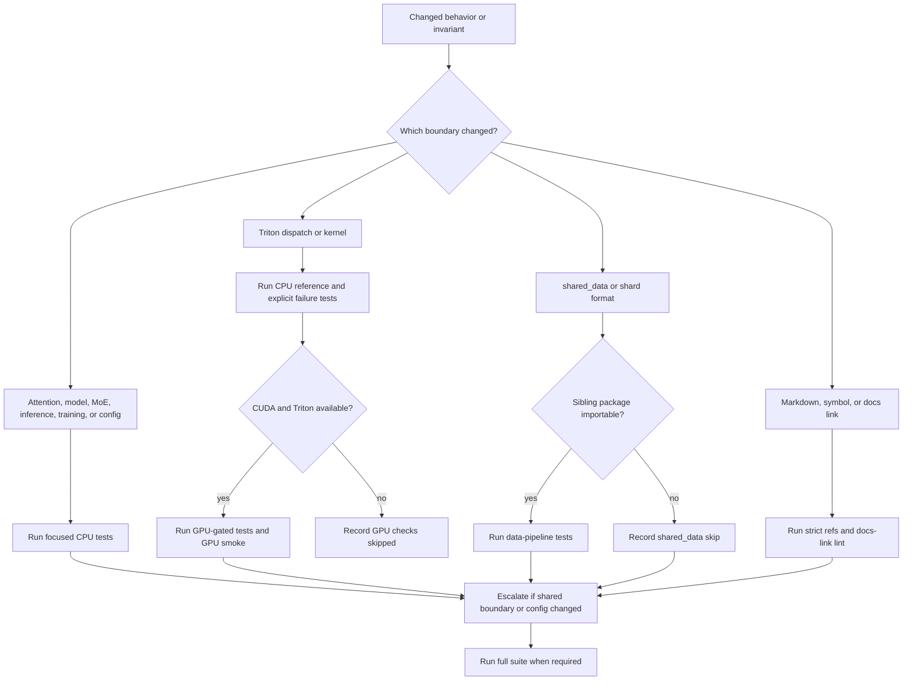

# Verification Matrix and Change-Safety Guide

This page is the change-safety map for GPT-OSS-Lite. The tests are the executable specification: source code defines the implementation, while tests define the behavior that a refactor must preserve. Start with the narrowest row that covers the changed contract, then escalate to the full suite when a shared boundary, configuration, or public documentation surface changes.

The default validation environment is CPU-only and offline. Small fixtures in `tests/conftest.py` keep attention, model, MoE, inference, YaRN, and training checks runnable without a GPU or downloaded corpus. GPU-only Triton checks are skipped when CUDA or Triton is unavailable. The data-pipeline module is different: it calls `pytest.importorskip("shared_data")`, so its tests skip when the sibling `shared_data` package is not importable rather than pretending that the external integration was tested.

## Decision flow

*This compact flow separates CPU proof, GPU/Triton proof, external-data availability, and documentation checks before escalation.*

## Fast command ladder

Run commands from the repository root. These are the standard commands; use the first applicable command after a local change and do not substitute a benchmark for a correctness test.

| Check | Command | What it proves | Environment and interpretation |
|---|---|---|---|
| Full suite | `python3 -m pytest tests/ -q` | Cross-component CPU correctness, regression coverage, and all available integrations | Default gate. A passing run may include skipped tests; inspect the summary, especially `shared_data` and GPU/Triton skips. |
| Attention-focused | `python3 -m pytest tests/test_attention.py -v` | Window masking, sink causality, prefill alignment, GQA, clamp behavior, and attention module contracts | Mandatory after any `models/attention.py` change; in particular, preserve `test_sliding_window_matches_full_small` and the prefill regressions. |
| KV benchmark | `python3 scripts/kv_cache_benchmark.py` | Analytical cache-size ratio at contexts through 131,072 tokens | CPU-friendly arithmetic check; it does not run a model or measure trained quality. |
| GPU smoke | `~/.venv/bin/python scripts/e2e_gpu_smoke.py` | Eight-step CUDA integration path: BF16 forward/backward, Triton equivalence, training loop, checkpoint round-trip, generation cache, and YaRN extrapolation | Requires CUDA and Triton. The script exits with an error when no CUDA device exists; that is an unavailable environment, not a CPU pass. |
| Strict doc references | `python3 tests/test_doc_refs.py --strict-coverage` | Every `file.py:Symbol` anchor resolves and all public symbols in the covered core modules remain anchored | Required after doc edits or symbol renames. Anchors in code fences are intentionally excluded by the checker. |
| Docs-link and stale-pattern lint | `python3 scripts/check_docs.py` | Markdown links, repository path references, control characters, and known stale wording | Required after documentation changes. Use `python3 scripts/check_docs.py --check-symbols` when the docs edit also changes code-symbol coverage. |

The repository also supports `python3 scripts/build_docs_html.py` as a docs-portal smoke check. It is useful when changing the generated HTML surface or assets, but it is not a substitute for link lint or strict symbol coverage.

## Behavior-to-test matrix

### Attention, positions, and long-context invariants

| Behavior or invariant | Authoritative regression coverage | Narrow validation |
|---|---|---|
| Even layer indices are sliding-window attention and odd indices are full attention; global layers may prune `head_dim // 4` RoPE dimensions | `tests/test_attention.py::test_attention_module_alternating_pattern`; `tests/test_models.py::test_alternating_layer_pattern`; `tests/test_models.py::test_global_layers_have_pruned_rope` | `python3 -m pytest tests/test_attention.py -v` |
| Prefill must enforce the sliding window, not merely decode-time masking. At position `t`, keys at or before `t - window` are excluded | `tests/test_attention.py::test_sliding_window_sdpa_matches_manual`; `tests/test_attention.py::test_sliding_window_blocks_past_keys_at_prefill`; `tests/test_attention.py::test_sliding_window_zeros_outside_window` | `python3 -m pytest tests/test_attention.py -v` |
| Full causal attention and windowed attention agree for positions inside the window; this protects the boundary at short contexts and `window == sequence length` | `tests/test_attention.py::test_sliding_window_matches_full_small`; `tests/test_attention.py::test_sliding_window_window_matches_full_inside`; `tests/test_validation.py::test_extreme_dim_window_equals_seq` | Attention-focused command; add `python3 -m pytest tests/test_validation.py -q` for dimension changes |
| Sink bias is an extra softmax denominator term, has per-head influence, and its zero-valued sink output does not add content | `tests/test_attention.py::test_sink_bias_absorbs_attention`; `tests/test_attention.py::test_sink_bias_per_head_differs`; `tests/test_attention.py::test_sink_and_window_compose_zero_bias` | `python3 -m pytest tests/test_attention.py -v` |
| Sink-enabled SDPA remains causal during prefill; future K/V corruption must not change an earlier query | `tests/test_attention.py::test_sink_path_matches_manual_at_prefill`; `tests/test_attention.py::test_sink_path_is_causal` | Attention-focused command |
| A learned sink parameter is clamped only at forward use to `[-10, 15]`, retaining the unclamped parameter for optimization and preventing BF16 mask overflow | `tests/test_attention.py::test_sink_bias_clamped_at_forward`; implementation constants and clamp in `models/attention.py` | Attention-focused command |
| Chunk-prefill causal alignment works when `T_q < T_k`: queries align to the end of the cached-key sequence and cannot see later keys | `tests/test_attention.py::test_causal_attention_chunk_prefill_cached_prefix_is_causal` | Attention-focused command |
| GQA repeats K/V from `n_kv_heads` to `n_heads` without changing the identity case or head ordering | `tests/test_attention.py::test_repeat_kv_identity`; `tests/test_attention.py::test_repeat_kv_doubles` | Attention-focused command |
| YaRN frequencies and rotations are finite at production scale, position-sensitive, pair-preserving, and explicit about degenerate ramps | `tests/test_yarn.py` (frequency, module, pruning, rotation, and warning tests) | `python3 -m pytest tests/test_yarn.py -q`; include it when changing RoPE, positions, or evaluation length |

Do not replace the alternating local/global schedule with pure full attention. That would change both the causal behavior and the cache-size contract even if short-context logits still look plausible.

### Inference and cache lifecycle

| Behavior or invariant | Authoritative regression coverage | Narrow validation |
|---|---|---|
| A new `MixedKVCache` is empty and `reset()` releases both windowed and global layer state | `tests/test_inference.py::test_kv_cache_initial_empty`; `tests/test_inference.py::test_kv_cache_reset` | `python3 -m pytest tests/test_inference.py -q` |
| Windowed layers retain only the latest `window` tokens, including chronological order after ring-buffer rollover | `tests/test_inference.py::test_kv_cache_append_windowed`; `tests/test_inference.py::test_kv_cache_windowed_preserves_order_after_rollover`; `tests/test_inference.py::test_kv_cache_seq_len_helper` | Inference-focused command |
| Global layers grow without truncation and preserve all cached K/V in insertion order | `tests/test_inference.py::test_kv_cache_append_global`; `tests/test_inference.py::test_kv_cache_global_preserves_full_order` | Inference-focused command |
| Greedy generation returns prompt plus exactly `max_new_tokens` and does not crash at `temperature=0` | `tests/test_inference.py::test_generate_shape`; `tests/test_inference.py::test_generate_no_crash_greedy` | Inference-focused command |
| Cached and no-cache generation agree for a one-token decode; no-cache replay is the correctness reference | `tests/test_inference.py::test_generate_use_cache_false_matches_cache_for_one_token` | Inference-focused command; run GPU smoke after cache changes |
| Passkey prompt construction honors start, middle, and end placement and extraction recognizes the expected five-digit form | `tests/test_inference.py::test_passkey_prompt_contains_passkey`; `tests/test_inference.py::test_passkey_position_start_middle_end`; `tests/test_inference.py::test_extract_passkey_from_output` | `python3 -m pytest tests/test_inference.py -q` |

The incremental path rotates new keys before caching them, appends them to a ring buffer for windowed layers or a growing buffer for global layers, then applies causal attention against the layer-appropriate view. Changes to cache append/get ordering should therefore be tested together with generation equivalence, not only with isolated buffer lengths.

### MoE routing and Triton execution

| Behavior or invariant | Authoritative regression coverage | Narrow validation |
|---|---|---|
| The router returns exactly `n_activated_experts` in-range indices, normalized selected weights, and logits for the auxiliary objective | `tests/test_moe.py::test_router_topk_indices`; `tests/test_moe.py::test_router_weights_sum_to_one`; `tests/test_moe.py::test_router_indices_in_range` | `python3 -m pytest tests/test_moe.py -q` |
| Routed expert outputs combine with the correct token weights, while every shared expert is always active | `tests/test_moe.py::test_moe_layer_dispatch_correct`; `tests/test_moe.py::test_moe_layer_shared_expert_active`; `tests/test_moe.py::test_moe_layer_shapes` | MoE-focused command |
| Dispatch is deterministic and uses stable ordering; routing should reach multiple experts rather than collapse to one | `tests/test_moe.py::test_moe_dispatch_is_deterministic`; `tests/test_moe.py::test_moe_layer_routes_to_all_experts_over_batch`; stable-sort construction in `tests/test_moe_triton.py::test_reference_matches_existing_moe_dispatch_shape` | `python3 -m pytest tests/test_moe.py tests/test_moe_triton.py -q` |
| The standard auxiliary load-balancing loss is finite, non-negative, lower for uniform routing, differentiable, and remains non-zero under saturated logits through FP32 softmax | `tests/test_moe.py::test_aux_loss_finite_and_nonneg`; `tests/test_moe.py::test_aux_loss_low_for_uniform`; `tests/test_moe.py::test_aux_loss_grad_flow`; `tests/test_moe.py::test_aux_loss_robust_to_bf16_saturation` | MoE-focused command |
| Auxiliary gradients reach the router and are accumulated into the training loss alongside cross-entropy | `tests/test_moe.py::test_moe_layer_grad_flow`; `tests/test_training.py::test_aux_loss_accumulated_in_training`; `tests/test_models.py::test_forward_returns_aux_loss` | `python3 -m pytest tests/test_moe.py tests/test_training.py -q` |
| The pure-PyTorch grouped reference matches a naive per-expert implementation and handles empty experts | `tests/test_moe_triton.py::test_reference_matches_naive_per_expert_loop`; `tests/test_moe_triton.py::test_reference_handles_empty_experts` | Always run on CPU before any GPU check |
| An explicitly configured `moe_dispatch="triton_grouped"` raises a clear `ImportError` without Triton and does not silently fall back; hard-cap violations raise `ValueError` | `tests/test_moe_triton.py::test_triton_moe_raises_when_triton_missing`; `tests/test_moe_triton.py::test_MoELayer_triton_dispatch_raises_when_triton_missing`; `tests/test_moe_triton.py::test_triton_moe_raises_on_hard_cap_violation` | `python3 -m pytest tests/test_moe_triton.py -q` |
| The actual Triton forward matches the CPU reference in FP32 and BF16 within the tested tolerances | `tests/test_moe_triton.py::test_kernel_forward_matches_reference_fp32`; `tests/test_moe_triton.py::test_kernel_forward_matches_reference_bf16` | GPU-gated in the test module; then `~/.venv/bin/python scripts/e2e_gpu_smoke.py` |

New Triton paths require both a CPU-runnable pure-PyTorch reference test and GPU-gated kernel tests. The repository policy also requires explicit opt-in configuration, a sanctioned-path update, and surfaced compile/runtime failures. Never add a catch-all fallback that changes an explicitly requested Triton run into the stacked path.

### Model, configuration, and parameter accounting

| Behavior or invariant | Authoritative regression coverage | Narrow validation |
|---|---|---|
| `ModelConfig` fails fast for invalid vocabulary, dimensions, head divisibility, expert counts, window, and YaRN settings; scale factor one remains valid | `tests/test_validation.py::test_modelconfig_rejects_zero_vocab` through `test_modelconfig_accepts_scale_factor_one` | `python3 -m pytest tests/test_validation.py -q` |
| `n_heads * head_dim == d_model`, even `head_dim`, and `n_heads % n_kv_heads == 0` protect projection views, RoPE pairs, GQA repetition, and residual width | `tests/test_validation.py::test_modelconfig_rejects_d_model_head_dim_mismatch`; `tests/test_validation.py::test_modelconfig_rejects_n_heads_not_multiple_of_n_kv_heads`; `tests/test_validation.py::test_modelconfig_rejects_odd_head_dim` | Validation-focused command |
| The full model returns finite `(B, T, vocab_size)` logits and a scalar, differentiable auxiliary loss; all learnable parameters receive gradients | `tests/test_models.py::test_forward_shape_small`; `tests/test_models.py::test_grad_flow_all_params`; `tests/test_smoke.py::test_tiny_forward_cpu`; `tests/test_smoke.py::test_tiny_backward_cpu` | `python3 -m pytest tests/test_smoke.py tests/test_models.py -q` |
| Weight tying makes embedding and output-head storage identical when enabled and separate when disabled; unique parameter counts do not double-count the tie | `tests/test_models.py::test_weight_tying`; `tests/test_models.py::test_weight_tying_disabled`; `tests/test_validation.py::test_active_params_correct_with_tied_weights` | `python3 -m pytest tests/test_models.py tests/test_validation.py -q` |
| Production total and active parameter anchors remain approximately 502M and 247M, with inactive routed experts omitted and the router counted once per layer | `tests/test_models.py::test_param_count_production`; `tests/test_validation.py::test_anchor_metric_502m_total`; `tests/test_validation.py::test_anchor_metric_247m_active`; `tests/test_validation.py::test_active_params_router_not_double_counted` | Model/validation command; this may be memory-heavy on CPU |
| Gradient checkpointing is not merely enabled: it is invoked at the configured cadence and preserves backward behavior | `tests/test_models.py::test_gradient_checkpointing_runs`; `tests/test_models.py::test_gradient_checkpointing_actually_checkpoints`; `tests/test_models.py::test_gradient_checkpointing_skip_layers` | `python3 -m pytest tests/test_models.py -q` |

Configuration edits are high blast-radius changes because one object feeds attention, RoPE, MoE, parameter accounting, and training. Run the validation and model rows together, then the full suite.

### Training, checkpoints, memory, and data

| Behavior or invariant | Authoritative regression coverage | Narrow validation |
|---|---|---|
| Warmup reaches its peak at the boundary, then cosine learning-rate decay is monotonic and ends at `min_lr_ratio` | `tests/test_training.py::test_lr_schedule_at_warmup_boundary`; `tests/test_training.py::test_lr_schedule_at_end`; `tests/test_training.py::test_lr_schedule_monotonic_decay_after_warmup` | `python3 -m pytest tests/test_training.py -q` |
| Chunked cross-entropy equals unchunked cross-entropy and propagates finite gradients | `tests/test_training.py::test_chunked_ce_matches_full`; `tests/test_training.py::test_chunked_ce_gradient_flow` | Training-focused command |
| Checkpoint save/load restores weights and metadata; complete steps are discoverable and older checkpoints can be retained or deleted as a unit | `tests/test_training.py::test_checkpoint_round_trip`; `tests/test_training.py::test_checkpoint_latest_step`; `tests/test_utils.py::test_checkpoint_keep_last_n`; `tests/test_utils.py::test_checkpoint_delete_specific_step` | `python3 -m pytest tests/test_training.py tests/test_utils.py -q` |
| Checkpoint writes use sibling temporary files and atomic replacement, leave no partial `.tmp` artifacts, and deduplicate tied safetensors storage | `tests/test_training.py::test_checkpoint_atomicity_no_partial_files`; `tests/test_utils.py::test_checkpoint_dedup_drops_duplicates`; atomic writer in `utils/checkpoint.py` | Training/utils command; include GPU smoke for CUDA round-trip |
| The NaN guard rejects non-finite loss rather than allowing an optimizer step to proceed | `tests/test_training.py::test_nan_guard_detection`; the five-step guard in `scripts/e2e_gpu_smoke.py` | `python3 -m pytest tests/test_training.py -q` |
| Memory estimates account for windowed steady-state versus full prefill KV, and checkpointing lowers activation estimates | `tests/test_utils.py::test_mixed_kv_cache_correct`; `tests/test_utils.py::test_estimate_smaller_with_checkpointing`; `tests/test_utils.py::test_estimate_with_grad_ckpt_every` | `python3 -m pytest tests/test_utils.py -q` |
| A single file and sharded training dataset yield shifted input/target windows; raw-byte and legacy Torch shards remain readable | `tests/test_training.py::test_pretrain_dataset_single_file`; `tests/test_training.py::test_pretrain_dataset_sharded`; external-format coverage in `tests/test_data_pipeline.py::TestPretrainDatasetNewFormat` | `python3 -m pytest tests/test_training.py -q`; run data tests only when `shared_data` is available |
| Shared-data IO, hashing, quality filters, EOS boundaries, dtype selection, shard verification, manifest validation, and synthetic pipeline integration remain coherent | `tests/test_data_pipeline.py` | `python3 -m pytest tests/test_data_pipeline.py -q`; a skip means the sibling package was unavailable, not that the integration passed |

The data module is intentionally an external integration boundary. Do not “fix” a missing-package skip by weakening `importorskip`; install or check out the sibling package when data behavior itself is under review.

## Headline metrics: what is and is not proven

The KV headline and passkey headline have different evidence status and must not be combined into one claim.

- **Measured analytical cache reduction:** `scripts/kv_cache_benchmark.py` computes BF16 bytes for 12 layers with six windowed layers capped at `WINDOW = 128` and six global layers retaining the full sequence. At 131,072 tokens it compares the mixed schedule with an all-full baseline and checks the configured `THRESHOLD = 1.8`. This is a deterministic size calculation, not a model execution benchmark; it validates the architecture's cache accounting and should remain near the documented ~2× reduction.
- **Pending trained passkey target:** the 128K passkey goal is an accuracy target for a trained 4K-context model extrapolated with YaRN. `inference/long_context.py` and `scripts/passkey_eval.py` provide the evaluation path, but the repository caveat is that `passkey_eval.py` requires a trained checkpoint and behaves as a stub on an untrained model. Passing the KV script therefore does not establish `≥ 85%` passkey retrieval.

Use the KV command after changing attention alternation, `window_size`, GQA dimensions, cache sizing, or the production architecture constants. Use the passkey evaluator only after a trained checkpoint exists, and report its measured accuracy separately from the analytical KV result.

## Documentation and automation gates

Documentation is part of the executable change contract. `tests/test_doc_refs.py --strict-coverage` resolves `file.py:Symbol` anchors and checks coverage for the core model, attention, MoE, RoPE, training, inference, checkpoint, memory, and logging modules. `scripts/check_docs.py` independently checks Markdown links, repository paths, control characters, and stale patterns. A symbol rename requires both updating the prose anchor and running both commands.

The repository's docs deployment workflow builds the HTML portal with `python3 scripts/build_docs_html.py` on documentation-related pushes, then uploads `docs_html` to GitHub Pages. The scheduled OpenWiki workflow refreshes the evidence index; it is not a replacement for the local unit, regression, benchmark, or GPU smoke gates. There is no claim here that a CPU-only run covers CUDA or Triton: those paths need the GPU environment and their explicit gates.

## Change recipes

- **Change `models/attention.py`, masking, sinks, RoPE positions, or cache alignment:** run `python3 -m pytest tests/test_attention.py -v`; if inference/cache code is involved, add `python3 -m pytest tests/test_inference.py -q`; run the KV benchmark when cache behavior or layer alternation changes; finish with the full suite.
- **Change `models/moe.py` or routing math:** run `python3 -m pytest tests/test_moe.py tests/test_moe_triton.py -q`, then `python3 -m pytest tests/test_training.py -q` for auxiliary-loss integration; use GPU smoke for CUDA-facing changes.
- **Add or change a Triton kernel:** first run the CPU reference and explicit-failure tests in `tests/test_moe_triton.py`; then run the GPU-gated tests and `~/.venv/bin/python scripts/e2e_gpu_smoke.py` on a CUDA/Triton host. Do not accept a silent fallback.
- **Change `ModelConfig`, defaults, YAML model fields, tying, or parameter accounting:** run `python3 -m pytest tests/test_validation.py tests/test_models.py tests/test_smoke.py -q`, then the full suite.
- **Change checkpointing, optimizer state, NaN handling, or memory estimates:** run `python3 -m pytest tests/test_training.py tests/test_utils.py -q`; add GPU smoke if device placement or CUDA serialization changed.
- **Change data formats or shared-data integration:** run `python3 -m pytest tests/test_data_pipeline.py -q` in a workspace where `shared_data` imports; also run the training dataset tests. Record an intentional skip when the sibling package is absent.
- **Change Markdown, symbol names, docs links, or generated docs assets:** run `python3 tests/test_doc_refs.py --strict-coverage`, `python3 scripts/check_docs.py`, and, for portal changes, `python3 scripts/build_docs_html.py`. A docs-only change does not need the full model suite unless it changes code anchors or generated behavior.

When in doubt, use `python3 -m pytest tests/ -q` after the focused command. Preserve the failure output and distinguish failed assertions, unavailable GPU/Triton resources, and the expected `shared_data` skip in review notes.
