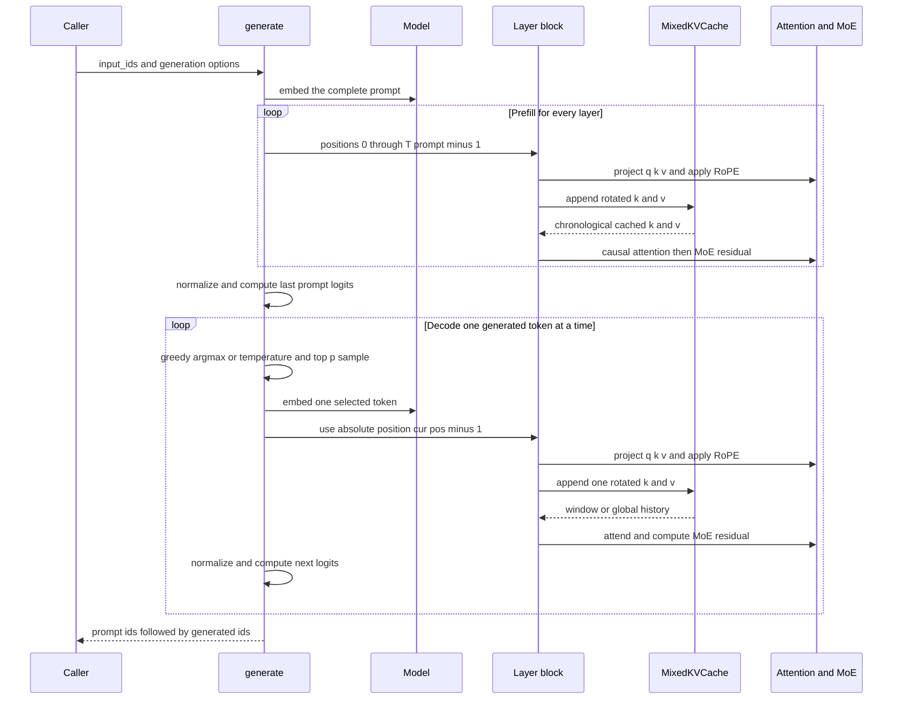
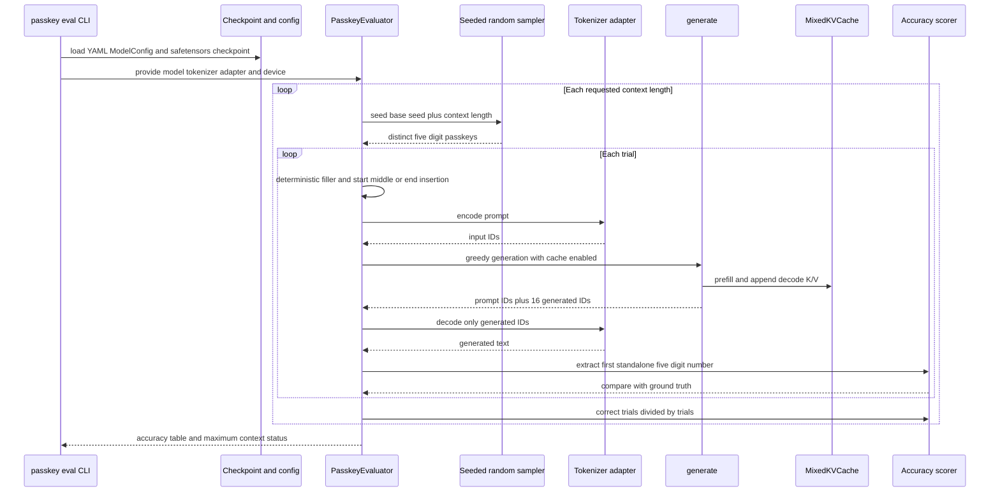

# Incremental Generation and Long-Context Evaluation

GPT-OSS-Lite has a training-oriented full-sequence model path and a separate incremental generation path. `inference/generate.py:generate` runs the prompt once, retains the per-layer key and value state needed by later tokens, and then advances one token at a time. Its default is the production path: `use_cache=True`, with a `MixedKVCache` that matches the model's alternating local and global attention layers.

The canonical model has 12 layers: even-indexed layers use a 128-token sliding window and odd-indexed layers retain global history. It also uses 8 query heads and 4 KV heads, so the cache stores four KV heads and expands them with `repeat_kv` only when attention is computed. This is the runtime counterpart of the architecture and configuration invariants described in the model-stack page.

## Runtime sequence: prefill and decode



*This sequence shows the cache-enabled path: one parallel prefill followed by cache-backed single-token decode.*

### Prefill

At entry, `generate()` calls `model.eval()`, moves the model to the input device, allocates the output tensor, and creates a new `MixedKVCache` when caching is enabled. The prompt is embedded as a `(B, T_prompt, d_model)` tensor. Prefill positions are `torch.arange(T_prompt)` on that device, so the first prompt token has position 0 and the last has position `T_prompt - 1`.

For each block, `_attn_forward_layer` performs the inference-specific block work:

1. Apply `norm1`, then compute query, key, and value projections.
2. Ask `YaRNRoPE` for cosines and sines at the supplied positions.
3. Apply RoPE to queries and keys. **The keys are rotated before they enter the cache; values are not rotated.**
4. Append the new K/V chunk and read the layer's attention history from the cache.
5. Expand the cached four-head K/V tensors to the query-head count with `repeat_kv`.
6. Clamp and reuse the learned sink bias when present, run causal attention, apply the output projection, and run the MoE residual sublayer.

The prefill result is normalized and projected by the language-model head. Only `x[:, -1, :]` is used to choose the first generated token, but the whole prompt pass is necessary to populate every layer's state. Windowed entries retain only their most recent `window_size` positions; global entries retain the complete prompt prefix.

Prefill and decode use the same absolute coordinate system. The position supplied for the first generated token is `T_prompt`, not zero and not an index relative to the 128-token window. In the loop, `cur_pos` starts at `T_prompt`, is incremented after the selected token is written, and `positions_step = torch.tensor([cur_pos - 1])` identifies that token's absolute position. This matters for RoPE and YaRN extrapolation: resetting positions at a decode-window boundary would encode the same token at the wrong phase and can cause repeated or otherwise corrupted output.

### Decode and sampling

Each decode iteration first chooses a token from the logits for the most recently processed position, writes it into the preallocated output buffer, embeds only that token, and runs all blocks with a one-element position tensor. Every layer appends one new K/V pair and reads its existing history; no prefix activations are re-forwarded when `use_cache=True`. The resulting hidden state produces logits for the next iteration.

Sampling has two deliberately distinct branches:

- `temperature <= 0` selects `argmax` directly. This is greedy decoding; `top_p` has no effect and this branch does not call a random sampler.
- `temperature > 0` divides logits by temperature, applies softmax, sorts probabilities, removes the tail after the smallest nucleus reaching `top_p`, renormalizes the survivors, and calls `torch.multinomial`. Lower temperatures sharpen the distribution; `top_p` then adapts the number of eligible tokens to the distribution's confidence.

`model.eval()` disables dropout. Consequently, greedy output is deterministic for fixed weights, prompt, and device. Sampling runs can be made reproducible with `torch.manual_seed` because the final multinomial draw is the loop's RNG consumer.

The returned tensor always contains the original prompt followed by exactly `max_new_tokens` slots of generated IDs, with shape `(B, T_prompt + max_new_tokens)`. `max_new_tokens=0` therefore returns the prompt without a decode iteration.

## `MixedKVCache`: ownership, storage, and lifecycle

`MixedKVCache` is indexed by `layer_idx` and owns separate storage for the two attention regimes. Its contract is deliberately heterogeneous:

| Layer kind | Storage | Read contract | Growth behavior |
|---|---|---|---|
| Windowed, `is_windowed=True` | `windowed_kv` ring buffer | Chronological keys and values, capped at `window` | Fixed `window` capacity |
| Global, `is_windowed=False` | `global_kv` dynamic arrays | The complete valid prefix | Capacity grows by roughly 1.5 times |

### Windowed layers: chronological ring reads

A windowed entry stores `buf_k`, `buf_v`, a `head` write index, and a `count` of valid positions. The initial append allocates `(B, H_kv, window, head_dim)` buffers. If a prefill chunk is at least the window size, only its last `window` rotated keys and values are copied and the entry is marked full. A shorter initial chunk is written from the beginning.

Later chunks are written at `head`, wrapping across the end when necessary. The head advances modulo `window` and `count` is capped at `window`. When the ring has wrapped, `get()` concatenates the suffix beginning at `head` with the prefix before `head`, so attention sees the retained tokens in temporal order rather than physical buffer order. This is the important invariant: eviction removes the oldest history, never the newest, and callers never need to know the ring layout.

Windowed cache maintenance is O(1) per one-token append and O(window) in storage. Attention still has to read the retained window, so its decode attention cost is proportional to `window`, not to the total context.

### Global layers: full prefix with amortized growth

A global entry keeps all K/V positions in insertion order. The first append allocates exactly enough capacity for that chunk. When `cur_len + T_new` exceeds capacity, the cache allocates `max(needed, int(cur_cap * 1.5) + 1)`, bounded by `_GLOBAL_CAP_TOKENS`, copies the valid prefix, and writes the new chunk. Otherwise it writes directly into unused capacity. `global_lengths` distinguishes valid data from slack, while `global_caps` records allocation size.

The default global safety cap is 4,000,000 tokens. It is far beyond the configured 131,072-token evaluation context, but an input beyond the cap can fail during growth rather than silently dropping global history. Global appends are O(1) amortized; global decode attention remains O(T) because full history must be read.

### Reset boundary and sink state

A cache has no prompt identity. An independent prompt must not inherit another prompt's K/V history. `generate()` enforces this by constructing a fresh cache and a fresh `sink_bias_cache` dictionary on every call. Code that owns a cache across calls must invoke `MixedKVCache.reset()` before starting a new prompt; reset replaces both storage collections and the global length and capacity metadata, releasing references to all prior layer buffers.

The sink-bias dictionary is also per generation call. It memoizes the forward-only clamp of each attention module's learned bias, so the same clamped tensor is reused across prefill and decode without turning the unclamped trainable parameter into a clamped parameter. The clamp range is `[-10.0, 15.0]`, protecting the BF16 mask-add path from overflow while preserving training gradients to the original parameter.

## Cache-disabled replay is a correctness reference

`use_cache=False` is intentionally not a second production implementation of long-context generation. Prefill still computes the prompt, but after each selected token the function rebuilds the entire generated prefix, embeds it, assigns `torch.arange(full_input.size(1))`, and runs all layers again without a cache. This is O(T²) work over a sequence of decode steps and becomes impractical at long context.

Its value is differential correctness: both paths should choose the same token when given the same fixed model and prompt. The focused test compares `use_cache=True` and `use_cache=False` for one greedy token and requires identical output. A mismatch points to position alignment, causal masking, RoPE placement, cache ordering, or stale state rather than to expected sampling variation. Production long-context evaluation must use `use_cache=True`; using the replay path at 128K measures the reference implementation's cost, not the mixed-cache design.

## Passkey evaluation

`inference/long_context.py:PasskeyEvaluator` and `scripts/passkey_eval.py` implement a configurable needle-style retrieval harness. The evaluator accepts a model and a tokenizer adapter with `encode(text)` and `decode(ids)` methods. The repository's CLI uses `_CharTokenizer` for portability: it maps characters to bounded integer IDs and reverses IDs back to low-ASCII characters. That adapter is a harness convenience, not the LLaMA-3 tokenizer distribution used by training. A meaningful production result therefore needs both a trained checkpoint and a tokenizer adapter that matches the checkpoint's training tokenizer.



*This sequence shows checkpoint loading, deterministic trial construction, cached greedy generation, answer extraction, and the final target check.*

### Prompt and trial construction

For each context length, `make_filler_text` uses `random.Random(context_length)` to choose from a small fixed word vocabulary until it reaches the requested word count. `build_prompt` inserts `The passkey is {passkey}.` at the start, midpoint, or end of the filler and appends the question template. The template currently also interpolates the passkey in `The passkey is {passkey}.` before asking for it, so the repository's exact harness should be interpreted as an implementation-specific protocol rather than assuming a hidden-key prompt.

`evaluate()` creates a fresh `random.Random(base_seed + ctx_len)` for each context length and samples distinct integers from `range(100_000)`, formatting each as a zero-padded five-digit string. Thus keys are deterministic for a fixed seed and context length, and no key repeats within a context-length batch until the 100,000-key population is exhausted. The filler is fixed for a context length; trials vary the sampled key. The API defaults to context lengths `4096, 8192, 32768, 65536, 131072`, `n_trials=100`, and the `middle` position. The CLI exposes all of these, plus `start` and `end`; its command-line `--n-trials` default is 10, so use `--n-trials 100` when reproducing the API-level headline estimate.

The `context_length` argument controls filler words before tokenization. The adapter determines the actual model sequence length. In particular, the CLI's character adapter truncates the encoded prompt to `cfg.eval_max_seq_len`, so its character-ID length is not equivalent to a real tokenizer's token count. For a production comparison at 128K, replace the adapter and verify the resulting tokenized length against `eval_max_seq_len=131072`.

### Scoring and determinism

Every trial calls:

```python
generate(
    model,
    input_ids,
    max_new_tokens=16,
    temperature=0.0,
    top_p=1.0,
    use_cache=True,
)
```

The evaluator removes the prompt IDs before decoding, searches generated text for the first standalone five-digit number using `r"\b(\d{5})\b"`, and counts an exact match with the sampled key. Greedy decoding isolates retrieval behavior from sampling noise. The deterministic key schedule and fixed filler make repeated runs comparable, subject to normal device-level numerical behavior.

The CLI requires `--checkpoint`. It constructs `ModelConfig` from `configs/pretrain_a100_502m.yaml`, builds `GPTOSS`, loads the safetensors state with `strict=False`, and selects CUDA when available. A missing checkpoint is an error. An untrained or mismatched checkpoint may still run, but garbage output and near-zero accuracy are expected; the script prints a warning and returns status 0 when the target is not met. The adapter and checkpoint must therefore be treated as part of the evaluation configuration, not incidental CLI details.

### Configurable positions and the 128K target

The CLI's `--position` selects `start`, `middle`, or `end`, and `--context-lengths` can contain any requested lengths. The final headline check uses the maximum supplied context length, not necessarily 131072. The repository treats the following 128K figures as targets, not completed measurements:

| Passkey position range | Target accuracy |
|---|---:|
| 0 to 32K | at least 95% |
| 32K to 96K | at least 90% |
| 96K to 128K | at least 85% |

The headline `85% at 128K` result is pending the first full trained-checkpoint run. The README's status likewise says that the planned 8.0B-token pretraining run has not yet started; do not present the target table as an observed result. The CLI prints `✅ HEADLINE METRIC PASSED` when accuracy at the maximum requested length reaches 0.85, otherwise it prints a trained-checkpoint warning while still returning 0.

Example production-shaped invocation:

```bash
python3 scripts/passkey_eval.py \
    --checkpoint path/to/model.safetensors \
    --n-trials 100 \
    --context-lengths 4096 8192 32768 65536 131072 \
    --position middle \
    --seed 42
```

## Operations, failures, and focused verification

| Symptom | Likely cause | Action |
|---|---|---|
| Wrong or repeated tokens during decode | Relative or reset positions | Preserve absolute `cur_pos - 1` positions |
| Cache path differs from replay path | Ring ordering, mask alignment, RoPE placement, or stale state | Run the cache-equivalence test and inspect layer state |
| Decode is unexpectedly slow | `use_cache=False` | Enable `use_cache=True` |
| Garbage passkey output | Untrained checkpoint or tokenizer mismatch | Use a trained checkpoint and a training-compatible adapter |
| OOM during 128K prefill | Long dense prefill, batch size, or insufficient VRAM | Use batch 1, BF16, and an appropriate evaluation device |
| Global history cannot grow | Sequence exceeds the 4M global cap | Shorten the request or use a model/cache policy designed for the longer context |
| Non-finite attention behavior | Sink clamp path bypassed | Keep the clamped sink bias path used by generation and training |

Run the focused inference tests after changing generation, cache, or passkey code:

```bash
python3 -m pytest tests/test_inference.py -v
```

These tests pin fresh-cache emptiness, window truncation, chronological ring reads, full global order, reset behavior, cache-enabled output shape, greedy generation, one-token cache equivalence, filler construction, position selection, and five-digit extraction. The GPU end-to-end smoke also exercises a small BF16 model through `MixedKVCache` generation. The analytical KV benchmark is separate: it validates the architecture-level memory claim without loading a checkpoint or measuring allocator behavior.
