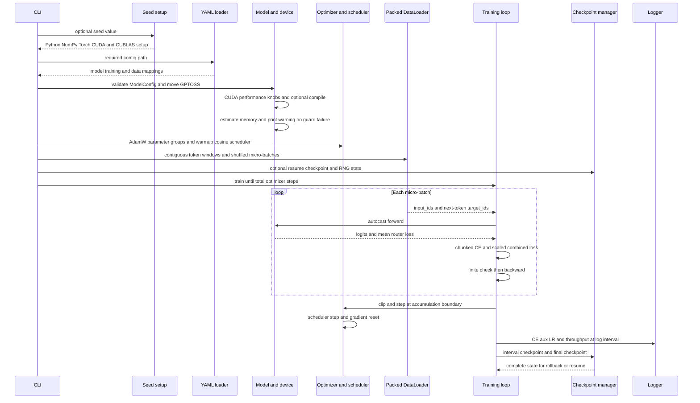
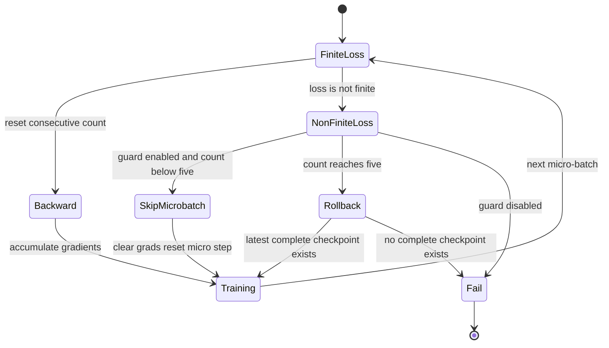

# Pretraining Runtime Workflow

`training/pretrain.py` is a single-device, raw-PyTorch pretraining entrypoint. It owns the run lifecycle rather than delegating to a trainer framework: optional seeding, hardware tuning, YAML interpretation, model construction, optimizer and scheduler setup, packed-token loading, the forward/backward loop, logging, checkpoints, NaN recovery, and final persistence.

The production recipe in `configs/pretrain_a100_502m.yaml` describes a 12-layer, 502M-parameter-class model with an 8/4 query/KV-head layout, top-2-of-8 routing plus one shared expert, BF16, sequence length 4096, micro-batch 8, accumulation 4, 61,000 optimizer steps, and a 2000-step checkpoint cadence. `configs/pretrain_gpu_smoke.yaml` keeps the same structural path at a small scale: four layers, sequence length 64, micro-batch 2, one accumulation step, five steps, and compilation disabled.

## Runtime sequence



*This sequence shows the normal control path from CLI/configuration to micro-batch execution and optimizer-step persistence.*

## 1. CLI, YAML, and run initialization

The command-line interface requires `--config` and accepts three optional controls:

```bash
python training/pretrain.py \
  --config configs/pretrain_a100_502m.yaml \
  --seed 42 \
  --resume-from 4000
```

- `--config` selects the YAML file.
- `--max-steps N` replaces `training.total_steps` after loading the YAML. This is an in-memory override for a short run; it does not rewrite the configuration file.
- `--seed N` enables the complete seeding path before model construction.
- `--resume-from N` asks `CheckpointManager` to restore model, optimizer, and scheduler state at step `N`.

The loader uses `yaml.safe_load`, maps `cfg["model"]` into `ModelConfig`, and leaves `training` and `data` as ordinary dictionaries. Consequently, model keys are checked by the dataclass constructor and `ModelConfig.__post_init__`, while optional training keys use defaults inside `pretrain.py`. Invalid structural values fail early: examples include non-divisible GQA heads, an inconsistent `d_model` and `n_heads × head_dim`, invalid MoE top-k counts, and invalid YaRN sequence settings.

The entrypoint validates `gradient_accumulation_steps >= 1` and `micro_batch_size >= 1` before allocating the model. Missing training data fails with an instruction to run `python data/prepare_data.py` first.

### Reproducibility contract

When `--seed` is supplied, `seed_everything` runs before model construction and performs all of the following:

```python
random.seed(seed)
np.random.seed(seed)
torch.manual_seed(seed)
if torch.cuda.is_available():
    torch.cuda.manual_seed_all(seed)
if os.environ.get("CUBLAS_WORKSPACE_CONFIG") is None:
    os.environ["CUBLAS_WORKSPACE_CONFIG"] = ":4096:8"
```

The last assignment is conditional in the implementation: `CUBLAS_WORKSPACE_CONFIG` is set to `:4096:8` only if it is not already present. Thus a seeded run preserves an existing caller-provided workspace setting, or installs `:4096:8` when absent. Python, NumPy, Torch, and all CUDA generators are explicitly initialized when CUDA is available.

Without `--seed`, `seed_everything` is not called. The entrypoint does not explicitly seed Python, NumPy, Torch, or CUDA and does not set `CUBLAS_WORKSPACE_CONFIG` in that path, so an unseeded run must be treated as non-reproducible. A seed is not retroactively added by the configuration files.

The final run writes `rng_step_N.pt` beside the final checkpoint with Python, NumPy, Torch, and CUDA generator states. On resume, the entrypoint restores those states if `rng_step_{resume_from}.pt` exists. The weight and optimizer checkpoint can still be resumed when that RNG file is absent, but the continuation is not guaranteed to reproduce the original random sequence. Exact continuation also depends on using the same hardware, software, DataLoader worker configuration, and data ordering behavior.

## 2. Device, model, CUDA behavior, and memory guard

The device is selected as `cuda:0` when CUDA is available and CPU otherwise. `GPTOSS(ModelConfig(...))` is moved to that device, and the entrypoint prints both the deduplicated total parameter count and the configured active-parameter estimate. Weight tying means the embedding and LM-head parameter is counted once.

`ModelConfig` defines the model-side contract. `GPTOSS.forward` embeds the token IDs, runs each attention/MoE block, averages the per-layer router losses, applies the final norm and returns `(logits, aux_loss)`. Gradient checkpointing is enabled after optional resume when `training.grad_checkpoint` is true. With the production setting `grad_checkpoint_every: 3`, blocks whose index is divisible by three use `torch.utils.checkpoint.checkpoint` with `use_reentrant=False`; backward recomputes those block forwards instead of retaining all of their activations.

### CUDA-only compile and performance behavior

`_set_hardware_perf_knobs` always attempts the generic `torch.set_float32_matmul_precision("high")`, but the CUDA-specific settings are guarded by `torch.cuda.is_available()`:

- TF32 is enabled for CUDA matmul and cuDNN.
- cuDNN benchmarking is enabled with an unlimited benchmark search.
- cuBLASLt is selected as the preferred CUDA BLAS library.

Compilation is also CUDA-only. The effective condition is `training.compile: true` **and** `dev.type == "cuda"`; the CPU path never invokes `torch.compile`, even if a YAML file requests compilation. CUDA compilation uses `torch.compile(model, mode=compile_mode, fullgraph=False)`. If compilation raises, the entrypoint prints a warning and continues with the uncompiled model. The first compiled/autotuned work can therefore be slower than steady-state steps.

The optimizer likewise uses `fused=(dev.type == "cuda")`, while `foreach=True` is requested on both paths. BF16 or FP16 is selected from `model.dtype`, defaulting to BF16 for an unknown value, but the autocast context is enabled only on CUDA. CPU execution therefore runs without the CUDA autocast region. There is no `GradScaler` in this loop.

### Memory estimation is a warning guard

Before creating the optimizer, the entrypoint calls `estimate_model_memory_gb` with the model sequence length, micro-batch size, and configured `grad_checkpoint` flag, then calls `assert_fits_in_available_gpu`. The estimate accounts for parameter and AdamW state storage, approximate activations, mixed local/global KV storage, and framework overhead. The entrypoint catches `RuntimeError` from this pair and prints:

```text
[memory] WARNING: ...
```

It then continues. This is a **warning guard in the current entrypoint, not an unconditional abort**. On CPU, `assert_fits_in_available_gpu` is a no-op. An actual allocation failure during later execution can still terminate the process.

One implementation detail matters when changing checkpoint cadence: the entrypoint does not pass `grad_ckpt_every` into the estimator, so the estimator uses its own default of 3. The actual model checkpointing cadence can differ, as in the smoke configuration where it is 2; treat the estimate as planning guidance rather than a measurement of the allocator.

## 3. Optimizer and scheduler lifecycle

AdamW receives two exhaustive parameter groups built from parameter-name substrings:

```python
no_decay = ["bias", "norm", "embed"]
decay_params = [p for n, p in model.named_parameters()
                if not any(nd in n.lower() for nd in no_decay)]
no_decay_params = [p for n, p in model.named_parameters()
                   if any(nd in n.lower() for nd in no_decay)]
```

The first group uses the configured `weight_decay`; the second uses zero decay. The production values are `lr: 4.0e-4`, `weight_decay: 0.1`, `beta1: 0.9`, `beta2: 0.95`, and the hard-coded `eps=1e-6`. The fused AdamW variant is selected only on CUDA.

The scheduler is a `LambdaLR` with a linear warmup followed by cosine decay to `min_lr_ratio` and a clamped floor. For the production configuration, the multiplier is 0 at step 0, reaches 1.0 at step 3000, decays toward 0.05 by step 61000, and remains 0.05 at or beyond the configured total. `sched.step()` is called exactly once per optimizer step, not once per micro-batch and not once per forward pass.

## 4. Packed-token input path

`data/prepare_data.py` is a small GPT-OSS-specific shim. It loads the shared universal data configuration, prints the corpus token budget, tokenizer metadata, and shard size, then delegates argument parsing and preparation to `shared_data.prepare_data.main`. The shared package is therefore the owner of corpus construction; this repository's training entrypoint is the consumer of its token stream.

`PretrainDataset` accepts either a single file or a directory:

- A single file is loaded with `torch.load(..., weights_only=True, mmap=True)`.
- A directory must contain sorted `shard_*.bin` files. Each shard is detected as a Torch-save archive by its `PK` header or as raw bytes by its alignment. Raw `uint32`, `uint16`, and `uint8` manifest dtypes map to the corresponding Torch integer type and are memory-mapped with `torch.from_file(..., shared=True)`.
- An optional `manifest.json` supplies `eos_token_id`, `vocab_size`, `total_tokens`, `shard_count`, and `dtype`. Loading remains usable when the manifest is absent or malformed.

An item is a contiguous window of `max_seq_len + 1` tokens. It returns:

```python
input_ids = chunk[:-1]
target_ids = chunk[1:]
```

Thus each sample has `max_seq_len` inputs and next-token targets. Windows normally remain within one shard; a window crossing a shard boundary is assembled from adjacent memory-mapped shards and then shifted. The dataset length is based on the available contiguous token count, and an empty shard directory or missing path raises `FileNotFoundError`.

The `DataLoader` uses the configured micro-batch size, `shuffle=True`, `drop_last=True`, `pin_memory` by default on CUDA, and `persistent_workers=True` when `num_workers > 0`. `num_workers` defaults to 4. The loop moves both tensors to the selected device with `non_blocking=True`. The production effective batch is 8 sequences × 4 micro-batches = 32 sequences, or 131,072 tokens at sequence length 4096, per optimizer step.

## 5. Forward, loss, and accumulation

For each micro-batch, the model executes inside:

```python
with autocast(device_type=dev.type, dtype=_amp_dtype,
              enabled=(dev.type == "cuda")):
    logits, aux_loss = model(input_ids)
    ce = chunked_cross_entropy(logits, target_ids, chunk_size=8192)
    loss = (ce + aux_alpha * aux_loss) / accum
```

The exact loss contract is:

\[
L_{\mathrm{backward}} =
\frac{\text{chunked CE} + \texttt{aux\_loss\_alpha} \times \text{mean router loss}}
     {\texttt{gradient\_accumulation\_steps}}.
\]

Here, chunked CE is the mean next-token cross-entropy over the micro-batch: each vocabulary-sized slice is reduced with `reduction="sum"`, the sums are accumulated, and the result is divided by the total token count. `GPTOSS` constructs `aux_loss` by taking the mean of the scalar router auxiliary loss returned by each block. The configured production coefficient is `aux_loss_alpha: 0.01`. The whole combined objective, not only CE or only the auxiliary term, is divided by accumulation **before** `backward()`.

This ordering makes the accumulated gradient the average of the micro-batch gradients and preserves the relative CE-to-router weighting. It also makes global-norm clipping operate on the effective-batch scale. Chunking changes the temporary CE working set, not the mathematical vocabulary normalization: softmax is over vocabulary for each token, while token losses are additive before the final mean.

After a finite loss, `loss.backward()` adds gradients to existing `.grad` buffers and increments `micro_step`. There is no optimizer update until:

```python
is_accum_boundary = (micro_step % accum == 0)
```

At that boundary the loop clips the global gradient norm when `grad_clip > 0`, calls `optim.step()`, calls `sched.step()`, clears gradients with `optim.zero_grad(set_to_none=True)`, increments the optimizer `step`, and advances the progress bar. `step` is therefore an optimizer-step counter; `micro_step` counts forward/backward micro-batches. Logging and interval checkpoint decisions use `step`, not `micro_step`.

The loop uses the next DataLoader micro-batch after an optimizer boundary and continues until `step >= total_steps`. A non-finite micro-batch is not allowed to contribute a partial accumulation, as described below.

## 6. Non-finite-loss handling and rollback

The loop checks `torch.isfinite(loss)` before backward. The guard is enabled by default and configured by `nan_guard` and `nan_guard_max_consecutive`, which are both `true` and `5` in the supplied configurations.



*This state flow shows that bad micro-batches are discarded and that five consecutive non-finite losses trigger checkpoint recovery or failure.*

The operational rules are:

1. A single non-finite loss increments the consecutive counter, clears accumulated gradients, resets `micro_step` to zero, and skips the batch.
2. Any finite loss resets the counter to zero and may resume ordinary accumulation.
3. When the counter reaches five, `CheckpointManager.latest_step()` selects the newest complete checkpoint. The loop reloads model, optimizer, and scheduler state, sets `step` to that checkpoint's step, resets the counter, and continues.
4. If no complete checkpoint exists, the loop raises `RuntimeError` rather than training through the failure.
5. If `nan_guard` is false, the first non-finite loss raises `RuntimeError` immediately.

**Do not disable the NaN guard as an operational recommendation.** The five-loss threshold is the implemented recovery policy; it protects the run by rolling back to the latest complete state, or fails explicitly when recovery state is unavailable.

`latest_step` and `list_checkpoints` consider a step complete when its model, optimizer, and metadata files exist. A scheduler file is written when a scheduler is supplied, but it is not part of the completeness predicate. The atomic save sequence protects each individual file with a sibling temporary file and `os.replace`; a failed write removes its temporary file.

## 7. Logging and checkpoint lifecycle

At each optimizer boundary, the entrypoint:

- calls `logger.log` when `step % log_interval == 0`, passing the current CE value, the current auxiliary loss as `aux`, and the scheduler's current LR;
- saves a checkpoint when `step > start_step` and `step % save_interval == 0`;
- updates the progress display with current CE and auxiliary values.

`TrainingLogger` aggregates the supplied `loss` values over a log window, computes perplexity from that aggregate, and prints step, loss, perplexity, LR, tokens per second, and supplied metrics. In this entrypoint the supplied `loss` is `ce`, not the combined backward scalar after auxiliary weighting and accumulation. The `aux` metric is supplied separately. Throughput uses `seq_len × micro_batch_size × accumulation` as the effective batch. If `WANDB_PROJECT` is set and the package is installed, the same metrics are forwarded to Weights & Biases; `logger.finish()` closes that optional run.

`CheckpointManager.save` writes:

- `model_step_N.safetensors` for model weights, deduplicating tensors that share a data pointer such as tied embedding and head weights;
- `optim_step_N.pt` for AdamW state;
- `sched_step_N.pt` when a scheduler is provided;
- `meta_step_N.json` for the step and optional metadata such as `aux_loss` or `final`.

The final checkpoint is unconditional after the loop, even when the total is not an interval multiple. The entrypoint then writes the final `rng_step_N.pt`, calls `logger.finish()`, and prints `[pretrain] Done.`. This final sequence is the durable end state for both model training and RNG continuation.

### Resume lifecycle

Resume happens after model, optimizer, scheduler, DataLoader, logger, and checkpoint manager construction, but before gradient-checkpointing activation and the training loop:

```python
meta = ckpt.load(model, step=resume_from,
                 device=str(dev), optimizer=optim, scheduler=sched)
start_step = meta["step"]
```

The loaded `start_step` initializes the progress bar and the loop counter. If the matching RNG file exists, Python, NumPy, Torch, and CUDA states are restored after the checkpoint state. The resumed run still ends with a new final checkpoint and RNG file.

## 8. Configuration profiles and operational commands

| Concern | A100 profile | GPU smoke profile |
|---|---:|---:|
| `d_model`, layers, vocabulary | 768, 12, 128000 | 128, 4, 4096 |
| `max_seq_len` | 4096 | 64 |
| micro-batch and accumulation | 8 and 4 | 2 and 1 |
| total steps | 61000 | 5 |
| `grad_checkpoint_every` | 3 | 2 |
| `compile` | true, CUDA-gated | false |
| `train_data_path` | `data/pretrain_chinchilla` | `data/pretrain_smoke` |
| checkpoint directory | `checkpoints/pretrain_a100` | `checkpoints/gpu_smoke` |

Run the full profile with:

```bash
python training/pretrain.py \
  --config configs/pretrain_a100_502m.yaml \
  --seed 42
```

Run a short deterministic smoke path with:

```bash
python training/pretrain.py \
  --config configs/pretrain_gpu_smoke.yaml \
  --max-steps 10 \
  --seed 0
```

Prepare the data through the repository shim before training:

```bash
python data/prepare_data.py --stage pretrain
```

The smoke YAML sets `compile: false` to avoid compilation latency in a short run and explicitly selects the stacked MoE dispatcher. The production YAML leaves the dispatcher at its `ModelConfig` default and enables compilation, but compilation still requires CUDA. A CPU smoke run remains useful for correctness of the model, dataset, loss, and checkpoint paths; it is not a performance or CUDA-kernel validation.

## 9. Focused verification

The tests cover the contracts that are safest to change independently:

- `tests/test_smoke.py` exercises tiny CPU forward and backward execution, finite outputs, auxiliary loss, configuration defaults, and model representation.
- `tests/test_training.py` checks warmup and final scheduler boundaries, monotonic cosine decay, chunked CE equivalence and gradient flow, single-file and sharded dataset windows, checkpoint round trips and atomicity, auxiliary gradients reaching routers, and `torch.isfinite` detection.
- `tests/test_utils.py` checks the memory estimator's local/global KV accounting and checkpointing effect, the CPU no-op memory guard, logger calls, checkpoint retention/deletion, and tied-weight safetensors deduplication.
- `tests/test_data_pipeline.py` checks the shared-data boundary when the sibling `shared_data` package is available, including raw-byte and legacy Torch-save shards, manifests, shard errors, and end-to-end synthetic preparation. The module is skipped when that sibling package is not importable.

These tests verify the components and invariants, but a test that forces five consecutive non-finite losses through `training/pretrain.py:main` is not present in the focused test set. Operational validation of rollback should therefore use a controlled checkpoint and an explicit failure injection in a separate test or staging run rather than weakening the production guard.
